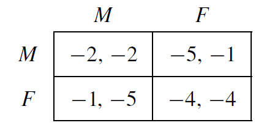

class: inverse, middle, center

```{r, load_refs, include=FALSE, cache=FALSE}
library(RefManageR)
BibOptions(check.entries = FALSE,
           bib.style = "alphabetic",
           cite.style = "alphabetic",
           style = "markdown",
           hyperlink = FALSE,
           dashed = FALSE)
myBib <- ReadBib("./eae0522_bib.bib", check = FALSE)
```

# Fundamentos da teoria dos jogos


---
class: middle
## Teoria dos Jogos

A teoria dos jogos estuda modelos lógico-matemáticos de como **agentes racionais** interagem de forma estratégica entre si

A teoria dos jogos **não** estuda o comportamento de humanos reais em tais interações, mas entendendo o que um agente puramente lógico faria, isso nos dá claridade sobre conceitos importantes como *barganha*, *reputação*, *credibilidade*, *comunicação*, *cooperação*, *incentivos*, etc

Por isso, a teoria dos jogos tem aplicações em economia, ciência política, relações internacionais, estratégia, além de mais recentemente se tornar importante em computação 


---
class: middle
## Teoria dos Jogos

Quando há motivo para crer que seres humanos agem parecidos com a predição lógica dos modelos, a teoria dos jogos tem valor **positivo** como predição do que vai acontecer no mundo real (p. ex. teoria de leilões)

Como todo resultado de ciência positiva, se os jogos realmente descrevem o comportamento das pessoas é *testável empiricamente* (na teoria dos jogos comportamental ou experimental)

Em algumas situações (mas nem sempre!), mesmo que as pessoas reais não ajam como na teoria dos jogos, ela pode ter valor **normativo** como a forma pela qual as pessoas *deveriam* se comportar (e.g., xadrez)

---
class: middle
## Esse curso

Cobriremos os principais temas de teoria dos jogos *não-cooperativos*: jogos estáticos de informação completa (parte 1), jogos dinâmicos de informação perfeita e imperfeita (parte 2) e jogos de informação incompleta (parte 3)

As aulas expositivas focarão principalmente na teoria, e vamos discutir aplicações e jogos importantes nos workshops de exercícios, para vocês refletirem por si mesmos sobre esses problemas

O que não vamos cobrir: em particular, temas importantes que não vamos cobrir são teoria dos jogos cooperativa, jogos de matching, e implementação e desenho de mecanismo

---
class: middle
## Jogos

Como o nome diz, a teoria dos jogos estuda **jogos**, que podem ser literalmente jogos, como xadrez, Hex, Nim, ou Poker; ou podem ser modelos que representam de forma simples interações entre agentes

Um jogo é representado por:

1. um conjunto de **jogadores**
2. cada jogador tem um conjunto (potencialmente diferente) de **ações**
3. cada jogador tem **preferências** entre os diferentes *perfis de ações* que podem ser resultantes do jogo 

---
class: middle
## O dilema dos prisioneiros

Sem dúvidas o mais importante e famoso jogo na teoria dos jogos é o **dilema dos prisioneiros** (e voltaremos a ele diversas vezes ao longo desse curso)

Nele, Ana e Bernardo estão na prisão esperando indiciamento. A evidência é suficiente para condenar ambos por caixa 2 (com tempo de prisão de 2 anos), mas se um dos dois fazer delação premiada, ele fica apenas 1 e o outro é preso por corrupção passiva (pena de 5 anos) &mdash; se ambos confessarem, os dois são presos pelo crime mais grave, mas com atenuante (pena de 4 anos)

Frequentemente estudaremos situações estilizadas como acima, mas elas guardam em si lições importantes sobre o mundo real

---
class: middle
## O dilema dos prisioneiros

Como representamos esta situação na forma de um *jogo*? Cada jogo tem (pelo menos) os três componentes que citamos anteriormente &mdash; no caso do nosso dilema dos prisioneiros, são:

1. **Jogadores:** Ana e Bernardo
2. **Estratégias:** Ana e Bernardo podem cooperar ou confessar
3. **Preferências:** Ana: para ela, (confessar, cooperar) é melhor que (cooperar, cooperar), que é melhor que (confessar, confessar), e o pior é (cooperar, confessar) &mdash; Bernardo: (cooperar, confessar) $\succ$ (cooperar, cooperar) $\succ$ (confessar, confessar) $\succ$ (confessar, cooperar)

Nesse curso vamos apenas(\*) estudar *jogos finitos*, em que o número de jogadores e o número de estratégias são ambos finitos

---
class: middle
## Preferências

Para alguns propósitos, tudo o que precisamos são das preferências **ordinais** dos jogadores (o que é melhor que o quê) &mdash; mas quando chegarmos em *estratégias mistas*, isto é, probabilidades sobre estratégias, isso não será mais suficiente: precisaremos de preferências **cardinais**

Então por consistência vamos desde o começo darmos valores numéricos para o 
*payoff* de cada jogador com cada perfil de estratégias: a **utilidade** $u_i (s_i, s_{-i})$

E vamos daqui em diante *supor* que se um agente ganha *payoff* de $5$ com probabilidade $1/2$ e $7$ com probabilidade $1/2$, então a sua utilidade é $$\frac{1}{2}5 + \frac{1}{2}7 = 6$$

---
class: middle
## Forma normal

Há infinitas matrizes de *payoffs* que representam o dilema dos prisioneiros, uma delas é: 

```{r, echo=FALSE, out.width = '30%', fig.align='center'}

```

Essa representação de jogos (especialmente de 2 jogadores), em que as linhas são as ações do jogador 1 (Ana) e as colunas as ações do jogador 2 (Bernardo) com os *payoffs* de cada perfil em forma de bimatriz (o 1o número é do jogador 1, o 2o do jogador 2) é chamada de **jogo na forma normal**

---
class: middle
## Informação completa

Mas há mais uma classe de suposições que estão "escondidas" por trás desse jogo em forma normal: que os jogadores sabem (i) quem são os outros jogadores, (ii) quais ações cada jogador tem, e (iii) os *payoffs* de todos os jogadores para cada perfil de ações

Na verdade, precisamos de *muito* mais do que isso: precisamos que cada jogador saiba que os outros jogadores sabem que ele sabe que eles sabem que ele sabe... &mdash; chamamos essa iteração de **conhecimento comum**

Quando supomos que todos os componentes do jogo são de *conhecimento comum* dizemos que temos um **jogo de informação completa**


---
class: middle
## Estratégias

Resta um conceito para definirmos antes de começarmos a resolver os jogos: as *estratégias* dos agentes, isto é, o que eles planejam jogar

Uma **estratégia pura** elenca para cada situação discernível pelo agente em que ele é chamado a jogar uma *ação*: nos jogos mais simples que analisamos nessa 1a parte do curso, uma estratégia pura é equivalente a uma ação (por exemplo, cooperar ou confessar) &mdash; mas mais frente no curso não será não!

Uma **estratégia mista** é uma distribuição de probabilidade *sobre as estratégias puras*: por exemplo, cooperar com probabilidade $1/3$ e confessar com probabilidade $2/3$


---
class: middle
## A guerra dos sexos

Outro jogo famoso que veremos algumas vezes ao longo do curso é a **guerra dos sexos**, de Luce e Raiffa.

```{r, echo=FALSE, out.width = '25%', fig.align='center'}
knitr::include_graphics("figs/week-1-fig-0.png")
```

Ao contrário do dilema dos prisioneiros, a guerra dos sexos é uma forma de **jogo de cooperação**: Ana e Bernardo querem sempre ir ao mesmo evento, por mais que Ana goste mais de ópera e Bernardo goste mais de futebol

---
class: middle
## Jogos estáticos

Em jogos na forma normal, é suposto que os jogadores escolhem as suas estratégias simultaneamente e sem observar a estratégia dos outros

Situações que ocorrem uma única vez e os jogadores decidem simultaneamente as suas estratégias (equivalentemente, ações), como o dilema dos prisioneiros ou a guerra dos sexos, são especialmente propícios para se modelar na *forma normal*

Chamamos esse tipo de interação estratégica de **jogos estáticos** (quando o aspecto temporal não é relevante) &mdash; e chegamos assim ao tópico desse primeiro terço do curso: *jogos estáticos de informação completa*


---
class: middle, center, inverse

# Racionalidade e dominância (Tadelis, cap. 4)

---
class: middle
## Racionalidade

A princípio, jogadores podem escolher as suas estratégias por qualquer motivo ("o nome tem mais letras", "eu gosto de escolher sempre a primeira opção", etc)

Para poder dizermos algo sobre o resultado do jogo (além do óbvio intuito normativo), precisamos supor que os agentes são **racionais** &mdash; definir racionalidade é difícil, porque algo como "os agentes buscam sempre maximizar o seu *payoff*" pode dizer coisas diferentes em situações diferentes 

E como veremos várias vezes ao longo do curso, em muitas situações ser "mais racional" pode levar a *payoffs* bem menores do que agentes "menos racionais"


---
class: middle
## Dominância

Em algumas situações, entretanto, é bem fácil (e crível) dizer o que é comportamento racional: como no caso da *dominância*

**Afirmação 1:** Se uma opção é estritamente melhor que todas as outras *não importa a estratégia do(s) oponente(s)*, então um jogador racional sempre vai escolher ela &mdash; chamamos esse tipo de estratégia de **estritamente dominante**

**Afirmação 2:** Um jogador racional nunca irá escolher uma estratégia que é sempre estritamente pior que alguma outra *não importa a estratégia do(s) oponente(s)* &mdash; chamamos esse tipo de estratégia de **estritamente dominada** 

---
class: middle
## O dilema dos prisioneiros

Já sabemos o suficiente para resolver o principal jogo da teoria dos jogos!

```{r, echo=FALSE, out.width = '30%', fig.align='center'}

```

Se a Ana escolhe cooperar, ela recebe $-2$ se Bernardo coopera e $-5$ se ele confessa; se Ana escolhe confessar, ela recebe $-1$ se Bernardo coopera e $-4$ se ele confessa &mdash; ou seja, *confessar é estritamente dominante*

Se Ana é racional, ela deve sempre confessar! Como o jogo é *simétrico*, o mesmo vale para Bernardo: se ele for racional, deve sempre confessar!

---
class: middle
## Equilíbrio em estratégias dominantes

Esse raciocínio nos leva ao nosso primeiro conceito de equilíbrio do curso: o **equilíbrio em estratégias dominantes**

O EES é o mais forte conceito de equilíbrio em teoria dos jogos: *se* ele existir, ele sempre vai ser *único*, e é o que depende de menos suposições sobre os jogadores para ser crível &mdash; tudo o que precisamos é que sejam racionais!

A sua aplicabilidade é rara, entretanto: poucos jogos são como o dilema dos prisioneiros em que todos os jogadores têm estratégias dominantes &mdash; em geral precisaremos de mais suposições para resolver um jogo

---
class: middle
## Equilíbrio em estratégias dominantes

Parece à primeira vista que como em um EES todos os jogadores estão jogando cada um uma estratégia que é *sempre* melhor que as outras, então os jogadores estariam garantindo o seu melhor *payoff* possível no jogo

(Chamamos em economia uma alocação que não há outra melhor para alguns e não-pior para todos de **eficiente de Pareto**)

O apelo do dilema dos prisioneiros é mostrar da forma mais simples possível que essa intuição está errada! O EES do jogo **não** é eficiente de Pareto: o perfil $(M, M)$, com *payoff* $(-2,-2)$ é estritamente melhor para ambos!

---
class: middle
## O dilema dos prisioneiros

> The idea that groups tend to act in support of their group interests is supposed to follow logically from this widely accepted premise of rational, self-interested behavior. In other words, if the members of some group have a common interest or object, and if they would all be better off if that objective were achieved, it has been thought to follow logically that the individuals in that group would, if they were rational and self-interested, act to achieve that objective. Olson (1965) apud `r Citep(myBib, "ostrom1990governing")`

Historicamente, o *dilema dos prisioneiros* foi importante para se contrapor à visão acima, comum no começo do século XX, de que agentes racionais sempre deveriam se coordenar para evitar situações ruins para todos

---
class: middle
## Dominança fraca

Um outro conceito importante nesse tópico é o de estratégias **fracamente dominantes** (ou analogamente para o oposto, *fracamente dominadas*)

Essas são as estratégias que: (i) contra pelo menos um perfil de estratégias dos outros jogadores é melhor; e (ii) nunca é estritamente pior que outra estratégia disponível, seja qual for a estratégia do oponente

Se convençam que esse é um conceito mais *fraco* que dominância estrita: para uma estratégia estritamente dominante $u(s_i, s_{-i}) > u(s^{\prime}_i, s_{-i})$ sempre; para uma estratégia fracamente dominante, contra alguns perfis de estratégias (mas não todos!) essa desigualdade pode ser uma igualdade

---
class: middle
## A guerra dos sexos

```{r, echo=FALSE, out.width = '30%', fig.align='center'}
knitr::include_graphics("figs/week-1-fig-0.png")
```

Voltemos agora à guerra dos sexos: o que podemos dizer sobre quais estratégias os jogadores irão escolher?

---
class: middle
## Racionalidade

A resposta é *nada*. Se Ana acredita que Bernardo vai ao futebol, ela quererá ir ao futebol; se ela acredita que Bernardo vai à ópera, ela quererá ir à ópera: sem saber quais são as **crenças** de Ana, não podemos saber o que ela vai jogar (mesmo supondo que ela é 100% racional)

Em termos de *dominância*, nenhuma estratégia dela é dominada ou dominante: racionalidade por si só não nos leva a frente

Para avançar mais em alguns jogos (no caso da guerra dos sexos não tem como), precisamos ir além da racionalidade de um jogador e supor que *os jogadores sabem que os outros são racionais*

---
class: middle
## Eliminação iterada

A ideia é que se eu sei que o outro jogador é racional, então eu sei que ele não vai jogar estratégias estritamente dominadas &mdash; então eu posso eliminá-las da minha análise

Podemos ir mais longe: se o oponente sabe que eu sei que ele é racional, então ele pode eliminar de consideração as minhas estratégias que são estritamente dominadas quando eu elimino as EEDs dele

Esse processo (seguido "infinitamente" quando há *conhecimento comum de racionalidade*) é chamado de **eliminação iterada de estratégias estritamente dominadas**

---
class: middle
## Eliminação iterada

Considere o jogo abaixo: quais estratégias sobrevivem a *eliminação iterada de estratégias estritamente dominadas*?

```{r, echo=FALSE, out.width = '45%', fig.align='center'}
knitr::include_graphics("figs/week-1-fig-3.png")
```

---
class: middle
## Eliminação iterada

Aqui a EIEED gera apenas um perfil de estratégias sobrevivente &mdash; quando um jogo é resolvível por EIEED, dizemos que ele é *resolvível por dominância*

Ainda que o requerimente de conhecimento comum de racionalidade seja (muito!) mais forte que apenas racionalidade do equilíbrio em estratégias dominantes, ainda assim é muito mais leve que outras noções de equilíbrio que veremos adiante

É importante notar (e fácil demonstrar) que não importa a ordem em que eliminamos EED na eliminação iterada de estratégias estritamente dominadas

---
class: middle
## Racionabilidade

A EIEED parte do princípio de identificar (e eliminar) estratégias que jogadores racionais "não jogariam nunca" &mdash; outra abordagem possível é se perguntar: "Quais crenças (sobre a estratégia dos oponentes) justificariam um jogador racional jogar tal estratégia?"

Essa ideia é chamada de **racionabilidade**: a seleção de que estratégias que são *racionalizáveis* por crenças sobre o comportamento dos outros jogadores

A racionabilidade parte do conceito (importantíssimo!) de **melhor-resposta**: uma estratégia é melhor-resposta a um perfil de estratégias dos outros jogadores se não há outra estratégia que dê *payoff* maior contra esse perfil

---
class: middle
## Racionalidade

A ideia de melhor-resposta nos dá outra afirmação sobre o comportamento de agentes racionais (e talvez a melhor definição de racionalidade):

**Afirmação 3:** Um jogador racional que acredite que os oponentes irão jogar um perfil de estratégias $s_{-i}$ sempre irá jogar uma melhor-resposta para $s_{-i}$

Se essa deve ser nossa definição de *racionalidade*, então seria importante que ela implicasse afirmações 1 e 2: e de fato isso acontece &mdash; é fácil mostrar que uma estratégia estritamente dominada não é melhor-resposta para nenhum perfil de estratégia dos oponentes, e se dominante é para todos

---
class: middle
## Racionalidade

Para o jogo abaixo, achemos as estratégias que são melhor-resposta para cada crença que os jogadores podem ter sobre as estratégias de seu oponente

```{r, echo=FALSE, out.width = '45%', fig.align='center'}
knitr::include_graphics("figs/week-1-fig-4.png")
```

---
class: middle
## Racionabilidade

E da mesma forma que com EIEED, *se tivermos conhecimento comum de racionalidade*, os jogadores podem considerar que estratégias dos oponentes são melhores-resposta para as suas crenças, e eliminar *estratégias que nunca são melhor-resposta*

A eliminação iterada de nunca melhor-respostas leva ao conjunto de **estratégias racionalizáveis**

EIEDS e estratégias racionalizáveis são conceitos equivalentes para jogos de 2 jogadores e *quase* equivalentes em jogos em geral

---
class: middle, center, inverse

# Equilíbrio de Nash em estratégias puras (Tadelis, cap. 5)


---
class: middle
## Solução de um jogo

Na teoria dos jogos, o que buscamos é dado um jogo "resolver" ele. Até aqui vimos 2 conceitos de "solução" de um jogo:

1. O **equilíbrio em estratégias dominantes** é a mais convincente solução na teoria dos jogos: ela depende apenas da racionalidade dos jogadores, e vale independentemente das crenças deles sobre a ação dos oponentes &mdash; infelizmente, raramente ela "morde"
2. Quando o jogo é **resolvível por dominância** (ou analogamente por **racionabilidade**), o perfil resultante é também uma solução convincente (mas menos, porque demanda conhecimento comum de racionalidade) &mdash; mas igualmente, em geral jogos não são resolvíveis por dominância

A análise com base em racionalidade não consegue avançar mais do que isso

---
class: middle
## Conceitos de equilíbrio

E talvez poderíamos argumentar (e certamente tem quem argumente) que *não deveríamos* avançar mais do que isso: deveríamos remover as ações estritamente dominadas (ou nunca melhor-resposta) e simplesmente dizer que todos os outros resultados são possíveis ¯\\\_(ツ)_/¯

Compreensivelmente, tal recomendação encontrou pouca aceitação entre os teoristas dos jogos, e especialmente entre os pesquisadores aplicados: para cada jogo, eles queriam uma solução (equilíbrio) que *sempre exista* e dê (preferencialmente apenas um!) perfil de estratégias resultantes

Para isso precisamos de hipóteses mais heróicas sobre os nossos jogadores

---
class: middle
## Equilíbrio de Nash

O conceito (de longe) mais importante em teoria de jogos é o equilíbrio de Nash &mdash; começaremos com uma definição que (reconhecidamente) não é a mais natural, mas que clarifica o tamanho do salto que estamos dando da seção anterior para cá

Um *perfil* de estratégias $(s_1, s_2)$ é um **equilíbrio de Nash** quando: (i) é conhecimento comum que ambos os jogadores são racionais; (ii) o jogador $1$ acredita que o jogador $2$ jogará $s_2$, o jogador $2$ acredita que o jogador $1$ jogará $s_1$, e *é conhecimento comum que eles estão certos*

---
class: middle
## Equilíbrio de Nash

Vimos já que um jogador racional sempre irá jogar uma melhor-resposta para a sua crença do que o outro jogador irá jogar &mdash; o equilíbrio de Nash adiciona a condição de *que essas crenças estão certas* (e isso é conhecimento comum)

Voltemos à guerra dos sexos: quais são os equilíbrios de Nash em estratégias puras do jogo?

```{r, echo=FALSE, out.width = '25%', fig.align='center'}
knitr::include_graphics("figs/week-1-fig-0.png")
```

---
class: middle
## A guerra dos sexos

Já vimos que todas as estratégias são racionalizáveis na guerra dos sexos (ou de outra forma nenhuma estratégia é estritamente dominada), o que implica que todos os perfis de estratégia podem ocorrer com jogadores racionais! 

É possível que Ana ache que Bernardo vai ao futebol e vá então ver futebol (sua melhor-resposta à sua crença), enquanto Bernardo ache que Ana vai à ópera e vá ele à ópera (sua melhor-resposta) &mdash; mas daí eles vão se desencontrar!

Mas esse *não* é um equilíbrio de Nash, pois *as suas crenças estão erradas*: os únicos equilíbrios de Nash em estratégias puras são $(O,O)$ e $(F,F)$

---
class: middle
## Equilíbrio de Nash

Um perfil de estratégias puras $(s_1^*, s_2^*, ..., s_N^*)$ é um equilíbrio de Nash quando para cada jogador $i$, $s_i^*$ é *melhor-resposta* para $s^*_{-i}$, i.e, para toda outra estratégia $s_i$ do jogador $i$:

$$u_i (s_i^*, s^*_{-i}) \geq u_i (s_i, s^*_{-i})$$

Outra forma de pensar em equilíbrio de Nash é que ele é *estável a desvios unilaterais*: se por acaso a situação normal (seja lá o que for isso) é jogar um EN, então ninguém desejará *sozinho* desviar

---
class: middle
## Entrevista na Blackrock

```{r, echo=FALSE, out.width = '65%', fig.align='center'}

```


---
class: middle
## Por que jogar equilíbrios de Nash?

Se jogadores puderem conversar antes do jogo e *se* eles concordarem em algum perfil de estratégias, então ela deve ser um EN (mas por que concordariam? E não deveria isso fazer parte da descrição do jogo?)

Se o jogo é repetido com jogadores *ingênuos* atualizando sua estratégia com base nos *payoffs* passados, então essa população tenderá a convergir a algum(ns) ENs (tal estudo é parte da *teoria dos jogos evolucionária*) `r Citep(myBib, "mailath1998people")` 

Também **normas e convenções sociais** podem *coordenar* ações em um EN (o que Schelling (1960) chama de **pontos focais**): em uma sociedade patriarcal, pode parecer razoável que Ana e Bernardo ambos esperem se encontrar no futebol (o favorito dele), e se crerem isso nenhum dos dois irá querer desviar


---
class: middle
## Por que jogar equilíbrios de Nash?

Uma variante das convenções é o *aprendizado de jogo*: se os agentes pudessem aprender sobre o seu oponente em vários *jogos fictícios* antes do jogo "de verdade", é razoável que eles eventualmente convergiriam para um EN

No fim do dia, o máximo que podemos dizer é que *se* há uma "forma óbvia" de se jogar o jogo, ela tem que ser um equilíbrio de Nash &mdash; ele nos dá então uma condição necessária, mas não suficiente, para "resolvermos" o jogo

Em alguns casos o EN vai ser uma resposta óbvia para o problema, como dirigir do lado direito da rua, mas em outros casos não (como dirigir do lado esquerdo) &mdash; isso dependerá do contexto e da nossa intuição

---
class: middle
## Algoritmo

Uma terceira forma de ver o equilíbrio de Nash é como um *ponto-fixo* da correspondência de melhor-resposta dos jogadores

Essa perspectiva é útil para (além de provar a existência de equilíbrio, que não faremos aqui) nos dar o seguinte algoritmo para encontrar EN

Para cada estratégia (por enquanto ação) dos oponentes (linhas para o jogador 2 e colunas para o jogador 1), marcar a sua melhor-resposta &mdash; quando acharmos um "ponto-fixo" (linha $k$ é melhor-resposta para coluna $j$ e coluna $j$ é a melhor-resposta para linha $k$) temos um equilíbrio de Nash

---
class: middle
## Achando equilíbrios de Nash

Usemos o algoritmo da seção anterior para encontrar os equilíbrios de Nash do jogo abaixo:

```{r, echo=FALSE, out.width = '45%', fig.align='center'}
knitr::include_graphics("figs/week-1-fig-3.png")
```

(Na verdade não precisávamos ter feito isso, como veremos no slide seguinte)

---
class: middle
## Equilíbrios de Nash e dominância

O equilíbrio de Nash tem várias relações com os conceitos vistos anteriormente:

1. Um equilíbrio de Nash nunca pode envolver estratégias estritamente dominadas (mas fracamente dominadas sim!!)
2. Um equilíbrio de Nash é sempre racionalizável, e nunca desaparece no processo de EIEED
3. Um equilíbrio em estratégias dominantes sempre é equilíbrio de Nash (e o único, pelo ponto 1.)
3. Se EIEED ou racionabilidade levam a um único perfil sobrevivente, então ele é um equilíbrio de Nash

---
class: middle
## Achando equilíbrios de Nash

Como isso é tão importante (a base de tudo que veremos daqui em diante), façamos mais um exemplo:

```{r, echo=FALSE, out.width = '45%', fig.align='center'}
knitr::include_graphics("figs/week-1-fig-5.png")
```

---
class: middle, center, inverse

# Estratégias mistas (Tadelis, cap. 6)

---
class: middle
## Estratégias mistas

Até aqui restringimos atenção a *estratégias puras* &mdash; mas e se Ana quiser jogar uma moeda para o alto e ir no futebol se der cara e na ópera se der coroa? Chamamos estratégias desse tipo de **estratégias mistas**

Isso pode ser importante, por exemplo, em **jogos de soma-zero**, em que frequentemente os jogadores não querem que o oponente saiba o que eles irão jogar (e lembrem-se que em um EN as crenças sempre são corretas, ou em outras palavras, todos sabem as estratégias dos oponentes!)

Outra importância é mais "teórica": acontece que apenas permitindo estratégias mistas podemos *garantir que sempre exista um equilíbrio de Nash*

---
class: middle
## Matching pennies

```{r, echo=FALSE, out.width = '25%', fig.align='center'}
knitr::include_graphics("figs/lista3-ex1.png")
```

Considere o jogo (se *soma-zero*) "par ou ímpar" acima: dois jogadores decidem ao mesmo tempo se mostram um número par de dedos (aqui $H$) ou ímpar (aqui $T$), e o jogador 1 ganha se a soma der par e o jogador 2 se a soma for ímpar &mdash; há equilíbrios de Nash em estratégias puras? 

---
class: middle
## Jokenpô

Outro jogo (também de *soma-zero*) que não tem equilíbrio de Nash em estratégias puras é o "pedra, tesoura ou papel" (aka Jokenpô) abaixo:

```{r, echo=FALSE, out.width = '55%', fig.align='center'}
knitr::include_graphics("figs/week1-fig6.png")
```

---
class: middle
## Estratégias mistas

Estratégias mistas dão um conjunto maior de estratégias disponíveis aos agentes, mas também será importante para nós que elas também dão um conjunto maior de *crenças sobre o que os outros jogadores podem fazer*

Se um jogador tem como possíveis estratégias puras (ações) $\{A, B, C\}$, então estratégias mistas são distribuições do tipo $\{p_A, p_B, p_C\}$, onde $p_S$ é a probabilidade do jogador escolher a estratégias $S$, e:

$$p_A,\ p_B,\ p_C \geq 0\text{ e }p_A + p_B + p_C = 1$$

---
class: middle
## Estratégias e crenças

Denotamos estratégias mistas por $\sigma_i (s_i)$ &mdash; note então que uma estratégia pura $s_i$ nada mais é que uma estratégia mista com $\sigma_i(s_i)=1$

Do mesmo jeito que estratégias, podemos pensar em crenças probabilísticas: uma **crença** de um jogador $i$ é uma probabilidade $\pi_i (s_{-i})$ para cada perfil de estratégias (puras) dos seus oponentes

Assim temos que no *matching pennies*, se o jogador $1$ acredita que o oponente jogará $\pi_1 (H) = 1/3$ e $\pi_1 (T) = 2/3$, a sua **utilidade esperada** de jogar $H$ é:

$$u \left(H, \frac{1}{3}\circ H + \frac{2}{3} \circ T\right) = \frac{1}{3} u\left(H, H \right) + \frac{2}{3} u\left(H, T \right) = \frac{1}{3} 1 + \frac{2}{3} (-1)$$

---
class: middle
## Cálculo probabilístico

O mesmo vale para estratégias mistas (com um pouquinho mais de conta): a utilidade esperada de uma estratégia mista $\sigma_i(H) = 1/2$ e $\sigma_i (T) = 1/2$ com as crenças do slide anterior é

$$u \left(\frac{1}{2}\circ H + \frac{1}{2}\circ T, \frac{1}{3}\circ H + \frac{2}{3} \circ T\right) = \frac{1}{6} u\left(H, H \right) + \frac{1}{6} u\left(T, H \right) +$$
$$\frac{1}{3} u\left(H, T \right) + \frac{1}{3} u\left(T, T \right) = \frac{1}{6} - \frac{1}{6} - \frac{1}{3} + \frac{1}{3} = 0$$

---
class: middle
## Racionalidade com estratégias mistas

O conceito de estratégias (e crenças) probabilísticas é muito importante para o que vimos antes: muitas vezes uma estratégia não é estritamente dominada por estratégias puras, mas o é para estratégias mistas

Analogamente, às vezes uma ação não é racionalizável por crenças em estratégias puras dos outros jogadores, mas é uma *melhor-resposta* para uma crença probabilística sobre as estratégias dos outros jogadores

Quando levamos em conta estratégias mistas, temos a seguinte equivalência: toda estratégia racionalizável sobrevive a EIEED, e se temos 2 jogadores, então o inverso também vale (i.e, os dois conceitos são equivalentes)

---
class: middle
## Racionalidade com estratégias mistas

Com essa nova arma sob os nossos braços, resolvamos então o jogo abaixo por *eliminação iterada de estratégias estritamente dominadas* e também por  *racionabilidade*:

```{r, echo=FALSE, out.width = '35%', fig.align='center'}
knitr::include_graphics("figs/week1-fig7.png")
```

---
class: middle
## Equilíbrio de Nash em estratégias mistas

A extensão do equilíbrio de Nash para estratégias mistas é direta: um *perfil* de estratégias mistas $\sigma^*$ é um **equilíbrio de Nash** quando para todo jogador $i$ $\sigma_i^*$ é *melhor-resposta* para $\sigma^*_{-i}$, isto é, para todo jogador $i$ e toda estratégia mista $\sigma_i$ de $i$:

$$u_i \left(\sigma_i^*, \sigma^*_{-i}\right) \geq u_i \left(\sigma_i, \sigma^*_{-i}\right)$$

---
class: middle
## Encontrando equilíbrios

Para encontrarmos ENs em estratégias mistas, o 1º passo é reconhecer que se duas estratégias puras têm probabilidade positiva em uma estratégia de equilíbrio $\sigma^*_i$, então elas precisam dar ao jogador $i$ um *payoff* igual contra $\sigma_{-i}^*$

Isso nos dá a *condição de indiferença* para estratégias mistas: uma estratégia mista só será um EN se o jogador aleatorizando estiver indiferente entre todas as estratégias puras jogadas com probabilidade positiva no equilíbrio

Para construir equilíbrios em estratégias mistas, portanto, precisamos que cada jogador escolha estratégias para deixar **os outros jogadores** indiferentes

---
class: middle
## Matching pennies

Voltemos ao "par ou ímpar". Sabemos que não há equilíbrio em estratégias puras, mas há em estratégias mistas? Chame $\sigma_1 (H) = p$ e $\sigma_2(H) = q$

Então a *condição de indiferença* requer que:

$$u\left(H, q \circ H + (1 - q) \circ T \right) = u\left(T, q \circ H + (1 - q) \circ T \right)$$
$$ = q u(H, H) + (1 - q) u(H, T) = q u(T, H) + (1 - q)u(T,T)$$

De onde vem que $q - (1-q)= (1-q) - q$ ou $q = 1/2$ &mdash; por simetria, temos que $p=1/2$ também: o único EN do jogo é $\left( (1/2, 1/2), (1/2, 1/2) \right)$

---
class: middle
## Existência

Na verdade, que o *matching pennies* tenha equilíbrio de Nash não é uma surpresa, pois como John Nash (Nobel '94) mostrou em sua tese de doutorado, todo jogo finito tem algum equilíbrio de Nash

**Teorema (Nash, 1950):** Todo jogo de $n < \infty$ jogadores em que o conjunto de estratégias $S_i$ é finito para todo jogador $i$ tem ao menos um equilíbrio de Nash em estratégias mistas ou puras

Note que em jogos infinitos (por exemplo, onde cada jogador escolhe um número entre $0$ e $1$) a existência de equilíbrio de Nash já não é necessariamente verdade

---
class: middle
## O teorema do índice

Outro teorema que vai ser bastante útil para nossos propósitos é o **teorema do índice**: jogos finitos em forma normal têm *quase sempre* um número **ímpar** (e em particular finito) de equilíbrios de Nash

O *quase sempre* aqui é para evitar *payoffs* iguais para perfis de ações diferentes (com essa dica, tente construir jogos $2\times 2$ com um número par ou infinito de equilíbrios)

Esse teorema é ótimo para resolver jogos, pois o número de equilíbrios em estratégias puras (fácil de achar) nos dá uma dica de quantos equilíbrios em estratégias mistas o jogo tem

---
class: middle
## Jokenpô

Analisemos agora o jokenpô abaixo: quais são os equilíbrios de Nash do jogo?

```{r, echo=FALSE, out.width = '55%', fig.align='center'}
knitr::include_graphics("figs/week1-fig6.png")
```

---
class: middle
## Justificando estratégias mistas

Se a pergunta "Por que as pessoas jogariam equilíbrios de Nash?" já deixa teoristas dos jogos acordados à noite, para ENs em estratégias mistas o problema é *muito pior*

Pois dado o perfil de estratégias $\sigma_{-i}^*$ dos outros jogadores, o jogador $i$ está completamente indiferente: e ainda assim, temos que acreditar que ele vai escolher exatamente $\sigma^*_i$, ainda que não ganhe absolutamente nada com isso!

Novamente, uma justificativa é evolucionária &mdash; veremos também mais no final do curso outra importante justificativa, no **teorema da purificação de Harsanyi**

---
class: middle
## Equilíbrio correlacionado

Os perfis de estratégias mistas podem gerar apenas distribuições que são *independentes* entre os jogadores: se 1 e 2 aleatorizam entre $H$ e $T$, então $(H,H)$, $(H,T)$, $(T,H)$ e $(T,T)$ têm que ocorrer com probabilidade positiva

Veremos no workshop a ideia que em algumas situações os jogadores podem condicionar suas estratégias a sinais que ambos observam, podendo jogar $(H,H)$ com probabilidade $1/2$ e $(T,T)$ com probabilidade $1/2$

Por exemplo, algum árbitro poderia jogar uma moeda para cima e propor cada perfil de estratégias dependendo de cara ou coroa &mdash; para ser um **equilíbrio correlacionado**, é necessário que ambos os jogadores queiram seguir o árbitro quando recebem a proposta de um perfil


---
class: middle
## Mais um exemplo

Terminemos essa seção com mais um exemplo, encontrando os equilíbrios de Nash do jogo abaixo:

```{r, echo=FALSE, out.width = '25%', fig.align='center'}
knitr::include_graphics("figs/week1-fig8.png")
```

---
class: middle, center, inverse

# Estratégias max-min e jogos de soma-zero (Osborne, cap. 11)

---
class: middle
## Jogos de soma-zero

**Jogos de soma-zero** foram historicamente os 1ºs a serem analisados `r Citep(myBib, "von2007theory")`, e são jogos *de 2 jogadores* em que os jogadores têm *interesse exatamente opostos*: se o jogador 1 ganha $1$, o jogador 2 perde $1$: os *payoffs* "somam zero"

Exemplos já vimos o par ou ímpar e o jokenpô, mas também temos xadrez, damas, poker, esconde-esconde, pega-pega &mdash; geralmente "jogos" mesmo, mas também há várias aplicações p. ex. em operações de guerra

Jogos de soma-zero também permitem uma interpretação interessante do equilíbrio de Nash como estratégias *maxminimizadoras* e *minmaximizadoras* dos jogadores, como veremos, que são conceitos importantes em geral

---
class: middle
## Maximinimização

Imagine que você se encontra em um jogo com um desconhecido sem ter ideia de qual será a estratégia dele: uma atitude conservadora é se proteger ao máximo caso o oponente queira te prejudicar (ou o faça inadvertidamente)

Para cada estratégia sua, você poderia checar qual é o *pior* resultado possível para si (dependendo da estratégia do oponente), e escolher a estratégia cujo *pior resultado* é o *menos pior*: essa é a **estratégia maximin**

$$\max_{\sigma_1} \min_{\sigma_{2}} u_1 (\sigma_1, \sigma_{2})$$ 

Aqui é como se você escolhesse "primeiro" uma estratégia $\sigma_1$, e o adversário sabendo $\sigma_1$ iria minimizar o seu *payoff* (i.e., $\min_{\sigma_{2}} u_1 (\sigma_1, \sigma_{2})$) &mdash; e esperando isso, você vai escolher $\sigma_1$ já querendo se precaver

---
class: middle
## Maximinimização

Ou seja, a *estratégia maximin* maximiza a utilidade esperada do jogador sob a hipótese (reconhecidamente bastante pessimista) de que o objetivo do outro jogador é prejudicar ao máximo ele

Agora se essa hipótese é demasiado pessimista na maior parte dos jogos, ela faz bastante sentido em jogos de soma-zero, pois cada jogador maximiza o seu *payoff* minimizando o do adversário! 

Outra forma de ver a maximinimização é que a utilidade esperada da **estratégia maximin** é o quanto o jogador $1$ consegue *garantir* de *payoff* no jogo *não importa o que o outro faça* (i.e., mesmo no pior cenário possível)

---
class: middle
## Exemplo

```{r, echo=FALSE, out.width = '25%', fig.align='center'}
knitr::include_graphics("figs/week1-fig9.png")
```

Considere o jogo acima em que apenas mostramos o *payoff* do jogador 1 (para os nossos propósitos o *payoff* de 2 é irrelevante): qual é a estratégia pura de 1 que é maximin? Existe alguma estratégia mista que garante um *payoff* maior para 1?

---
class: middle
## Um algoritmo

```{r, echo=FALSE, out.width = '35%', fig.align='center'}
knitr::include_graphics("figs/week1-fig10.png")
```

Considere o jogo de soma-zero acima (note que os *payoffs* para cada perfil de ações de fato sempre somam zero). Qual é a estratégia *maximin* para os jogadores 1 e 2? Uma dica é achar a estratégia que dá o mesmo *payoff* para o jogador maximinizador não importa o que o outro jogar (percebam a diferença para um EN em estratégia mista!)

---
class: middle
## Minimaximização

O conceito "inverso" da maximinimização é a **minimaximização**: $$\min_{\sigma_2} \max_{\sigma_{1}} u_1 (\sigma_1, \sigma_{2})$$ 

De novo, (heuristicamente) "lemos da esquerda para a direita" "no tempo": primeiro o oponente escolhe uma estratégia $\sigma_2$ tentando sacanear você, mas você pode responder a $\sigma_2$ escolhendo a sua **melhor-resposta** &mdash; e novamente, prevendo isso o jogador 2 irá escolher $\sigma_2$ tal que a sua melhor-resposta àquela estratégia lhe dê a menor utilidade possível

A estratégia *minimax* é o valor mínimo que o jogador 2 pode *garantir que o jogador 1 não exceda*

---
class: middle
## Minimax e maximin

```{r, echo=FALSE, out.width = '65%', fig.align='center'}
knitr::include_graphics("figs/week1-fig11.png")
```

Utilizemos o que acabamos de aprender para achar as estratégias maximin e minimax em estratégias puras para o jogador 1 no jogo acima!

---
class: middle
## A desigualdade max-min

Um resultado (que aliás vale de forma muito mais geral) de matemática que nos será útil é que sempre será verdade que: $$\max_{\sigma_1} \min_{\sigma_{2}} u_1 (\sigma_1, \sigma_{2}) \leq \min_{\sigma_2} \max_{\sigma_{1}} u_1 (\sigma_1, \sigma_{2})$$

Ou seja, o valor máximo que o jogador 1 pode garantir para si sempre é menor ou igual o valor mínimo que o jogador 2 pode garantir que 1 não exceda &mdash; isso vale em geral! Caso o jogo seja de soma-zero, temos também que (como $\min f(x) = - \max (-f(x))$):

$$\min_{\sigma_2} \max_{\sigma_{1}} u_1 (\sigma_1, \sigma_{2}) =  \min_{\sigma_2} \left( - \min_{\sigma_{1}} u_2 (\sigma_1, \sigma_{2})\right) = - \max_{\sigma_2} \min_{\sigma_{1}} u_2 (\sigma_1, \sigma_{2})$$

---
class: middle
## A desigualdade max-min

Ou seja, em um jogo de soma-zero a estratégia minimax do jogador 1 dá os mesmos *payoffs* que a estratégia maximin do jogador 2!

Juntando os dois resultados, temos que:

$$\max_{\sigma_1} \min_{\sigma_{2}} u_1 (\sigma_1, \sigma_{2}) \leq - \max_{\sigma_2} \min_{\sigma_{1}} u_2 (\sigma_1, \sigma_{2})$$

(Lembrando que em um jogo de soma-zero os *payoffs* dos jogadores 1 e 2 sempre têm sinais opostos) &mdash; existe situações em que essa desigualdade vale com igualdade? O polímata Von Neumann, uma das maiores mentes da história humana, quando não ocupado criando armas de assassinato em massa provou em 1928 que sim!

---
class: middle
## O teorema minimax

Certamente o primeiro grande teorema de teoria dos jogos, e que marca o nascimento da disciplina, é o **teorema minimax**:

**Teorema (Von Neumann, 1928):** Em um jogo finito, para todo jogador $i$,

$$\max_{\sigma_1} \min_{\sigma_{2}} u_1 (\sigma_1, \sigma_{2}) = - \max_{\sigma_2} \min_{\sigma_{1}} u_2 (\sigma_1, \sigma_{2}) = u_1(\sigma_1^*, \sigma_{2}^*) = v$$
onde $\sigma^*$ é (qualquer) *equilíbrio de Nash* do jogo! Chamamos $v$ do **valor do jogo** &mdash; ou seja, em um jogo de soma-zero um perfil de estratégias é equilíbrio de Nash *se e somente se* cada jogador está jogando sua *estratégia maximin*


---
class: middle
## E se o jogo não for de soma-zero?

```{r, echo=FALSE, out.width = '25%', fig.align='center'}
knitr::include_graphics("figs/week-1-fig-0.png")
```

Voltemos à famosa guerra dos sexos: qual é a estratégia *maximin* e *minimax* do jogador 1? Quais são os equilíbrios de Nash do jogo? Como eles se comparam?

---
class: middle
## Jokenpô

```{r, echo=FALSE, out.width = '55%', fig.align='center'}
knitr::include_graphics("figs/week1-fig6.png")
```

Vamos terminar a primeira parte do curso voltando ao famoso jokenpô! Agora vocês nunca mais vão perder de crianças de 5 anos jogando esse jogo (espero)!


---
class: middle
## Conclusão

E essa foi (uma introdução para) a teoria de **jogos estáticos de informação completa**!

Esses são jogos que acontecem apenas uma vez e ambos jogadores agindo ao mesmo tempo (*jogo estático*), e que é conhecimento comum para todos os jogadores todos os componentes do jogo (número de jogadores, *payoffs*, estratégias disponíveis, que o jogo é estático, que a *informação é completa*)

O próximo passo é relativizar ambas as suposições no nome: que os jogos são estáticos (parte 2, que olhamos **jogos dinâmicos**) e que a informação é completa (parte 3 do curso, **jogos de informação incompleta**)

---
class:middle
# Bibliography

<small>
```{r refs, echo=FALSE, results="asis"}
PrintBibliography(myBib)
```
</small>

