class: inverse, middle, center

```{r, load_refs, include=FALSE, cache=FALSE}
library(RefManageR)
BibOptions(check.entries = FALSE,
           bib.style = "alphabetic",
           cite.style = "alphabetic",
           style = "markdown",
           hyperlink = FALSE,
           dashed = FALSE)
myBib <- ReadBib("./eae0522_bib.bib", check = FALSE)
```

# Jogos em forma extensiva (Tadelis, caps. 7 e 8)

---
class: middle
## Jogos estáticos

Jogos estáticos ignoram qualquer aspecto temporal das interações estratégicas &mdash; até agora isso não era um problema pois estávamos estudando interações entre agentes que ocorriam de forma *once and for all*

A forma normal supõe que os jogadores "programam a sua estratégia em um computador" no começo do jogo e o algoritmo implementa ela não importa o que acontecer ao longo da interação

Embora isso ainda seja útil para alguns propósitos, o jogo se desenrolar temporalmente traz considerações de **racionalidade sequencial** (e de infomação) que frequentemente gostaríamos de introduzir na análise

---
class: middle
## Guerra dos sexos

Voltemos (mais uma vez) ao jogo da guerra dos sexos abaixo: 

```{r, echo=FALSE, out.width = '25%', fig.align='center'}
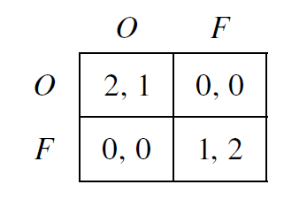
```

Mas considerem a seguinte variante: Ana sai mais cedo de casa, e com isso ela pode chegar primeiro na ópera ou no futebol e tirar uma foto para colocar no Instagram, que o Bernardo irá ver antes de decidir aonde vai

---
class: middle
## Guerra dos sexos

Nós representamos essa situação no **grafo** (mais especificamente, uma *árvore*) abaixo, que representa um **jogo na forma extensiva**:

```{r, echo=FALSE, out.width = '35%', fig.align='center'}
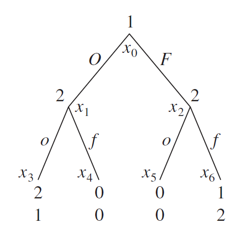
```

---
class: middle
## O jogo na forma extensiva

O jogo na forma extensiva expande no jogo estático que vimos antes tendo os seguintes componentes sendo **conhecimento comum**:

1. Os jogadores
2. Os *payoffs* de cada jogador para cada resultado do jogo (as *folhas* da árvore)
3. A ordem dos movimentos dos jogadores
4. O que cada jogador sabe quando é chamado a jogar (vamos começar com jogos que todos os jogadores sabem tudo o que aconteceu antes)
5. As ações de cada jogador em cada ponto no qual é chamado a jogar

---
class: middle
## Informação

É importante perceber que o mais importante para definir as estratégias dos agentes não é a *ordem cronológica* do jogo em si, mas *o que os jogadores sabem ao tomar a sua decisão*

Mesmo que a Ana esteja na ópera há horas quando Bernardo decide onde ir, se ele não viu as suas fotos no Instagram, então *estrategicamente* o jogo é o mesmo que se eles decidissem simultaneamente onde ir

Jogos (extensivos) em que os jogadores em todo momento que são chamados a jogar sabem de todas as ações até aquele instante são chamados de **jogos de informação perfeita** (diferenciar de *informação completa*!)

---
class: middle
## Conjuntos informacionais

```{r, echo=FALSE, out.width = '65%', fig.align='center'}
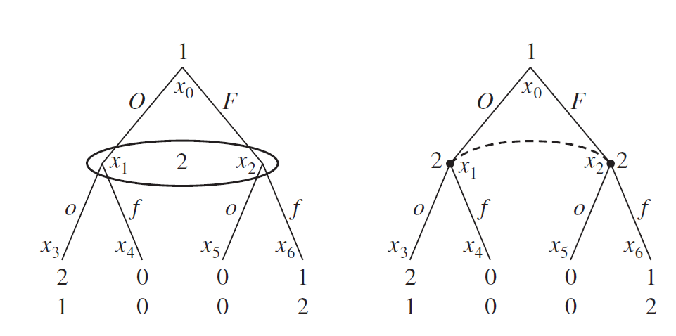
```

Um jogo em forma normal pode ser sempre representado na forma extensiva com uma seleção apropriada de **conjuntos informacionais**: quando vários pontos de tomada de decisão (do mesmo jogador) estão no mesmo conjunto informacional, isso significa que o jogador não sabe em qual dos vértices dentro do conjunto ele se encontra (por motivos óbvios, em todos os vértices no mesmo conjunto as ações disponíveis precisam ser iguais)

---
class: middle
## Jogos de informação imperfeita

```{r, echo=FALSE, out.width = '55%', fig.align='center'}
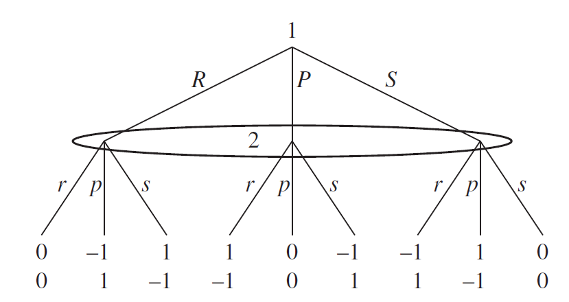
```

Outro exemplo: **jokenpô** representado na forma extensiva com informação imperfeita (ambas as formas representam exatamente o mesmo jogo!) &mdash; um jogo tem **informação imperfeita** quando algum conjunto informacional de algum jogador tem mais de um elemento (vértices)

---
class: middle
## Jogos com lances da natureza

```{r, echo=FALSE, out.width = '65%', fig.align='center'}
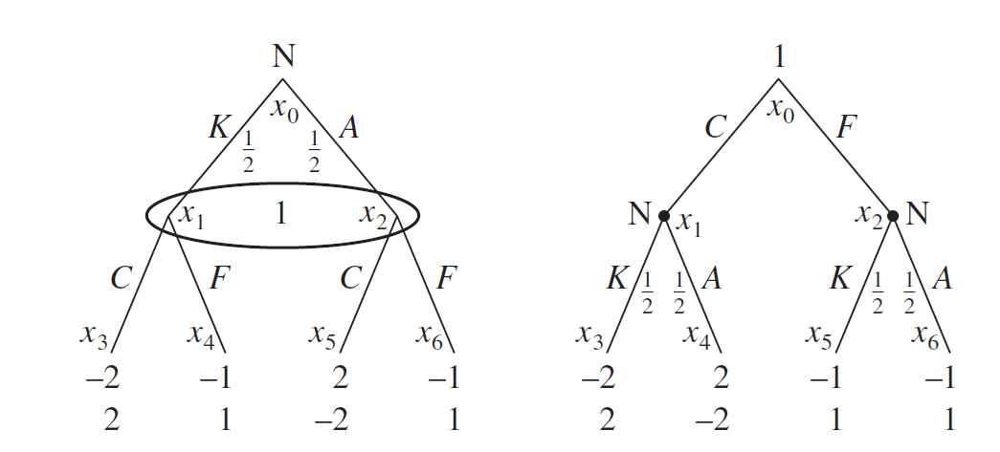
```

Vários tipos de jogos envolvem chance (p. ex. tirar cartas de um baralho): em teoria dos jogos, geralmente chamamos essa aleatoriedade de **lances da natureza**: a "natureza" como um jogador especial que escolhe uma estratégia mista que é conhecimento comum de todos os outros jogadores

---
class: middle
## Estratégias

No começo do curso definimos uma estratégia (pura) elencando para cada situação discernível pelo agente em que ele é chamado a jogar uma *ação*

Na época essa definição pareceu um pouco pedante, já que só havia uma situação em que cada jogador era chamado a jogar: uma estratégia era simplesmente a ação escolhida! (p. ex. ir à ópera ou futebol)

Mas agora fica clara a importância da definição: uma **estratégia pura** é um plano de jogo que define para cada **conjunto informacional** uma ação que o jogador planeja jogar &mdash; como antes, estratégias mistas ainda são aleatorizações sobre o conjunto de *estratégias* (não ações!!) puras

---
class: middle
## Estratégias na guerra dos sexos

```{r, echo=FALSE, out.width = '35%', fig.align='center'}

```

Para Ana, as estratégias são apenas ações, como anteriormente: ir à ópera $O$ ou ao futebol $F$ &mdash; mas para Bernardo, agora ele pode escolher $oo$, $of$, $fo$, $ff$, onde $of$ representa a estratégia "eu vou à ópera se eu ver fotos de Ana na ópera, e vou ao futebol se ver fotos dela no futebol"

---
class: middle
## Estratégias comportamentais

Notem que o número de estratégias puras cresce exponencialmente no número de conjuntos informacionais de cada jogador: um jogador com 3 conjuntos, cada um com 3 ações já tem 27 estratégias puras do jogador 2!

Como antes, uma **estratégia mista** é uma aleatorização sobre *estratégias puras*: ou seja, no exemplo acima, sobre as 27 estratégias puras (!)

Uma alternativa mais simples são as **estratégias comportamentais**, que a cada conjunto informacional aleatoriza entre as ações disponíveis nos vértices daquele conjunto: o que reduz de 27 probabilidades para 9 nesse exemplo!

---
class: middle
## Estratégias comportamentais

Luce e Raiffa (1957) faz a seguinte analogia: uma estratégia pura é um manual, que diz a cada conjunto informacional o que jogar &mdash; uma estratégia mista é escolher aleatoriamente um manual e segui-lo até o final

Já uma *estratégia comportamental* é um manual que em algumas páginas propõe aleatorizar sobre as ações naquele conjunto informacional &mdash; bem mais simples!

Mas faz diferença? Pode ser provado que em **jogos de *perfect recall*** (jogos em que nenhum jogador esquece informação que antes tinha) estratégias mistas e comportamentais são equivalentes

---
class: middle
## Jogos extensivos em forma normal

A forma normal ainda tem utilidade mesmo em jogos na forma extensiva, pois *o conceito de equilíbrio de Nash não incorpora nenhum aspecto dinâmico*


```{r, echo=FALSE, out.width = '45%', fig.align='center'}
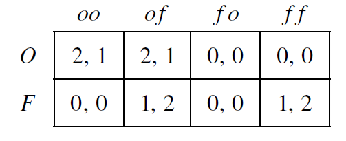
```

O jeito mais fácil de achar os equilíbrios de Nash de um jogo dinâmico é escrevê-lo na forma normal e usar as técnicas da parte anterior do curso &mdash; mas não esqueçam que temos que adicionar *todas* as estratégias, como acima

---
class: middle
## Caminhos de jogo

O jogo tem 3 ENs em estratégias puras (e em estratégias mistas?): dois deles dando *payoffs* iguais para os dois jogadores &mdash; o que muda entre eles é o comportamento do jogador 2 *fora do caminho de equilíbrio*

E isso é importante! Note que $(F, ff)$ é um EN, mas $(F, of)$ *não é*, por mais que ambos proponham a mesma ação como resposta ao que o jogador 1 *efetivamente joga* (e portanto deem o mesmo *payoff* a ambos os jogadores)

```{r, echo=FALSE, out.width = '35%', fig.align='center'}
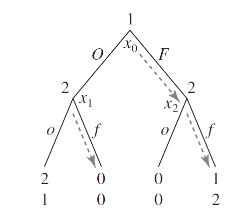
```

---
class: middle
## Caminhos de equilíbrio

Um conjunto informacional está no **caminho de equilíbrio** se ele é atingido com probabilidade positiva (não precisa ser 1) em equilíbrio; caso contrário está *fora do caminho de equilíbrio*

Estratégias fora do caminho de equilíbrio são importantes: $(F, ff)$ é um equilíbrio de Nash porque Ana acredita (*sempre corretamente!*) que caso ela for à ópera, Bernardo mesmo sabendo disso ainda assim irá para o futebol

Mas esse equilíbrio é peculiar: pois Ana não acredita na racionalidade de Bernardo *fora do caminho de equilíbrio*! Se ela de fato fosse na ópera, o melhor para ele seria ir à ópera também, mas ela acredita que ele vai no futebol

---
class: middle
## Credibilidade

Isso nos traz a ideia de **credibilidade**: pode se argumentar que o equilíbrio $(F, ff)$ (e $(O, oo)$) é menos razoável que $(O, of)$ pois ele se baseia em uma "ameaça não crível" de que se Ana for à ópera, Bernardo irá ver futebol

A ideia é que *se* os jogadores pudessem se comunicar antes do jogo, e Bernardo dissesse a Ana: "Ana, vá ao futebol, pois se você escolher a ópera eu vou ao futebol mesmo assim!", então *essa ameaça não seria crível*

Agora a crença de Ana de que Bernardo *não é racional fora do caminho de equilíbrio* não é tão irrazoável quanto pode à 1ª vista parecer: pois vejam que eles só vão sair do caminho de equilíbrio se alguém já agiu irracionalmente!

---
class: middle
## Racionalidade sequencial

Esse é um ponto que vai ser repetidamente importante no nosso curso: *caso algum jogador faça algo "fora do script", o que isso diz ao outro jogador sobre ele?* E isso é importante, já que os equilíbrios dependem do contrafactual!

Os jogadores podem pensar que o desvio foi apenas um erro ("mãos tremeram"), e que depois ambos vão voltar a jogar racionalmente: isso nos leva ao conceito de **racionalidade sequencial** e **indução para trás**

Ou eles podem racionalizar a ação diferente por meio do seu comportamento futuro, o que nos leva à **indução para frente** &mdash; como veremos nos workshops, ambos os conceitos podem gerar resultados contraintuitivos

---
class: middle
## Racionalidade sequencial

Dizemos que uma estratégia mista $\sigma_i$, dadas estratégias $\sigma_{-i}$ dos outros jogadores, é **sequencialmente racional** se $\sigma_i$ é melhor-resposta a $\sigma_{-i}$ *em cada um dos seus conjuntos informacionais*

Quando jogadores empregam estratégias seq. racionais eles escolhem racionalmente em *todos* os conjuntos informacionais, mesmo nos não ocorrem em equilíbrio (EN requer racionalidade apenas no caminho do jogo)

Como o que é racional no começo depende dos *payoffs* que vêm depois, nós começamos do final, e resolvemos "de trás para frente" o jogo: é esse procedimento que chamamos de **indução para trás**, ou *backwards induction*


---
class: middle
## Indução para trás na guerra dos sexos

```{r, echo=FALSE, out.width = '35%', fig.align='center'}

```

Apliquemos o que acabamos de aprender para resolver por *indução para trás* a guerra dos sexos sequencial acima

---
class: middle
## Teorema de Zermelo

**Teorema de Zermelo:** Todo jogo finito de informação perfeita possui um equilíbrio de Nash sequencialmente racional. Ademais, se caminhos diferentes de jogo dão sempre *payoffs* diferentes a todos os jogadores, então *só há um* EN sequencialmente racional

**Corolário (Zermelo, 1913):** No xadrez, ou as brancas possuem (pelo menos) uma estratégia que garante sempre a vitória, ou as negras possuem uma estratégia que garante sempre a vitória, ou ambas as cores possuem alguma estratégia que garante pelo menos o empate

---
class: middle
## Subjogos

Em jogos finitos de informação perfeita, podemos aplicar a indução para trás: comece pelas folhas, escolha o *payoff* maior (se for igual qualquer um), e passe esse *payoff* para o tronco anterior, e assim até chegar ao começo

Com informação imperfeita ou jogos não finitos já não é mais claro como proceder &mdash; uma generalização do equilíbrio de Nash que segue a intuição da racionalidade sequencial e aborda também esses casos usa a ideia de *subjogos*

Um **subjogo** consiste de *um* vértice do jogo e *todos* os seus seguidores, com a restrição de que se um elemento de um conjunto informacional pertence ao subjogo, então *todos os elementos daquele conjunto precisam pertencer*

---
class: middle
## Exemplo

```{r, echo=FALSE, out.width = '45%', fig.align='center'}
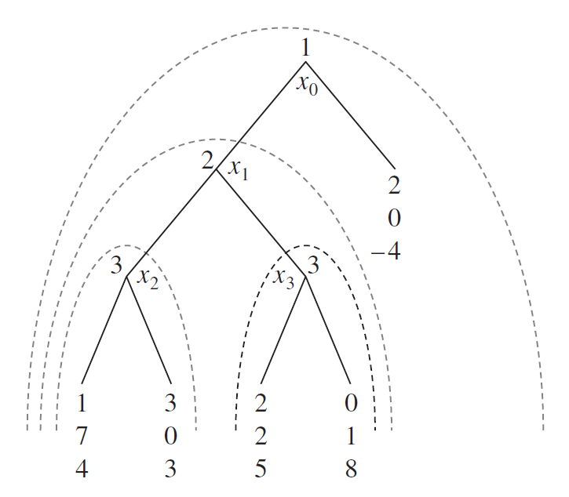
```

Todos os subjogos de um jogo de informação perfeita &mdash; esse jogo possui 4 subjogos: o jogo inteiro é trivialmente um subjogo, assim como cada vértice do grafo do jogo junto com *todos* os seus descendentes

---
class: middle
## A batalha dos sexos voluntária

```{r, echo=FALSE, out.width = '40%', fig.align='center'}
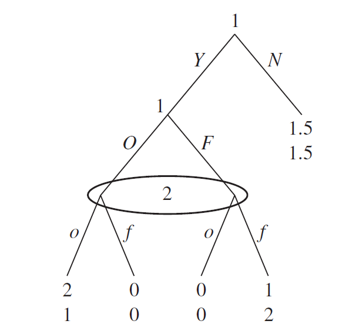
```

Considere agora a batalha dos sexos voluntária: Ana pode decidir tentar encontrar Bernardo, ou desistir e ambos ficarem em casa vendo um filme &mdash; quais são os subjogos do jogo?

---
class: middle
## Equilíbrio perfeito em subjogos

Richard Selten (Nobel '94) em 1974 utilizou a ideia de subjogos para criar um dos principais **refinamentos de equilíbrio**: o equilíbrio perfeito em subjogos, que complementa o equilíbrio de Nash com racionalidade sequencial

Um perfil de estratégias comportamentais forma um **equilíbrio (de Nash) perfeito em subjogos** quando esse perfil restrito a cada subjogo do jogo forma um *equilíbrio de Nash* no subjogo

Todo equilíbrio perfeito em subjogos é equilíbrio de Nash, mas aquele requer que os jogadores ajam racionalmente *mesmo em subjogos que não ocorrem no caminho de equilíbrio*, eliminando ENs (portanto, um "refinamento") 

---
class: middle
## A batalha dos sexos voluntária

```{r, echo=FALSE, out.width = '40%', fig.align='center'}

```

Podemos aplicar o equilíbrio perfeito em subjogos nos exemplos vistos até aqui &mdash; na batalha dos sexos voluntária a indução para trás não funciona: quais são então os equilíbrios de Nash e perfeitos em subjogos


---
class: middle
## "Um divide, o outro escolhe"

Uma forma bastante comum entre crianças de dividir, por exemplo, uma caixa de bombons, em que alguns doces são mais gostosos que os outros, é o "um divide, o outro escolhe"

Essa forma de divisão gera naturalmente um jogo em forma extensiva, e que tem um único equilíbrio perfeito em subjogos que dá a ambos utilidade igual

E as crianças são sábeis: esse é um bom método de **implementar** uma alocação igualitária quando *valores são comuns* mas desconhecidos (pelo adulto)

---
class: middle
## Barganha

Das várias formas de interação estratégica entre pessoas, algumas das mais importantes são situações de **barganha**: é natural então que modelos desse tipo estão entre os mais importantes e estudados na teoria dos jogos

O modelo principal de barganha é devido a Ståhl (1972, 1977) e Rubinstein (1982), e é um modelo de informação completa em forma extensiva em que os jogadores se revezam para fazer (e aceitar ou recusar) ofertas de divisão do bolo

Mas *tempo é dinheiro*: a cada período de barganha sem os jogadores chegarem a um acordo o bolo perde $\delta$ vezes o seu valor

---
class: middle

```{r, echo=FALSE, out.width = '30%', fig.align='center'}
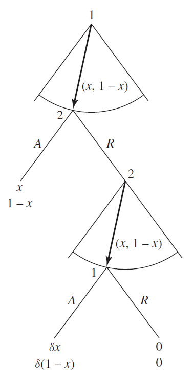
```

Forma extensiva do modelo de barganha &mdash; no 1º período, o jogador 1 oferece $(x, 1-x)$ e o jogador 2 ou aceita ou recusa &mdash; se aceitar, o jogo acaba com esses *payoffs*, se recusar ele continua com o jogador 2 oferecendo, mas agora o tamanho do bolo é $\delta$, e assim em diante até $T$ (acima $T=2$), quando o jogo acaba e ambos recebem *payoff* $0$

---
class: middle
## Barganha finita

O primeiro resultado é que o conceito de equilíbrio de Nash é pouco informativo &mdash; *todas* as divisões podem ser divisões de equilíbrio com acordo no primeiro período  

Já equilíbrio perfeito em subjogos nos dá uma resposta *bem* mais refinada: pelo argumento de indução para trás, há um *único* equilíbrio perfeito em subjogos

Se o jogo tem 1 período (**ultimato**), então o único equilíbrio de Nash que obedece racionalidade sequencial é o primeiro jogador propor $(1,0)$ e o segundo jogagor aceitar &mdash; se tem 2 períodos, daí o equilíbrio é $(1-\delta, \delta)$

---
class: middle
## Barganha finita

Em barganha finita, há três tipos de "poderes de barganha":

1. Há um **first-mover advantage**, pois em equilíbrio os jogadores chegam a um acordo no 1º período, e quem propõe pode se aproveitar do fato do bolo diminuir até o próximo período 
2. Há um **last-mover advantage**, porque no último período o jogo é de *ultimato*, e quem fizer a proposta pode deixar $0$ para o outro jogador
3. Aqui analisamos o caso em que os fatores de desconto são iguais, mas no caso mais geral *o jogador mais paciente tem maior poder de barganha*

Assim o resultado vai depender se $T$ é par (e cada jogador tem umas das vantagens)
ou ímpar (e o jogador 1 tem ambas) &mdash; nesse último caso, a solução é $x_1^* = (1 + \delta^T)/(1 + \delta)$ e $x_2^* = (\delta - \delta^T)/(1+\delta)$

---
class: middle

```{r, echo=FALSE, out.width = '35%', fig.align='center'}
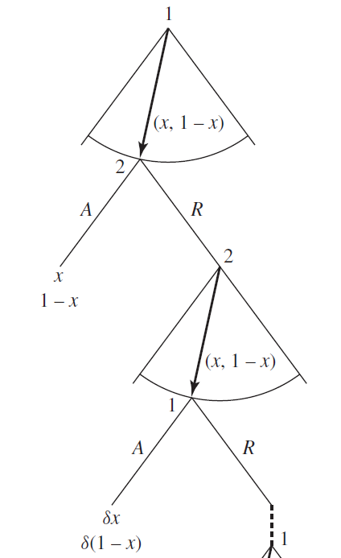
```

A vantagem de se jogar por último pode parecer "forçada", porque depende inteiramente do exato momento em que a barganha acaba &mdash; uma alternativa então é a barganha não ter limite, seguindo indefinidamente caso não haja concordância entre as partes

---
class: middle
## Barganha infinita

Jogos (potencialmente) infinitos são mais difíceis de se resolver, pois não podemos aplicar a *indução para trás* como fizemos antes &mdash; aqui utilizaremos o fato do jogo ser **estacionário**: cada período o jogo é exatamente igual, mas com identidades trocadas

Assim, qualquer estratégia de equilíbrio possível para o jogador 1 no 1º período é possível para o jogador 2 no 2º período: então deve ser verdade que $v = 1 - \delta v$

Com isso chegamos que o único equilíbrio perfeito em subjogos tem o jogador 1 oferecendo $(1/(1+\delta), \delta/(1+\delta))$ e o jogador 2 aceitando no 1º período


---
class: middle
## Jogos extensivos de informação imperfeita

Podemos aplicar os mesmos conceitos vistos antes a jogos de **informação imperfeita**, em que algumas ações anteriores não são observáveis

Se a imperfeição informacional vir no fim do jogo, então frequentemente a análise até aqui é inteiramente satisfatória: veremos vários exemplos desse tipo na lista 5 &mdash; mas se é no começo, então teremos poucos (ou apenas 1!) subjogo, e a perfeição em subjogos perde o seu poder

Nesse caso precisaremos de **refinamentos de equilíbrio** que levem mais a sério as *crenças* dos jogadores, que é o tópico do fim do curso

---
class: middle
## Jogos extensivos de informação imperfeita

```{r, echo=FALSE, out.width = '80%', fig.align='center'}
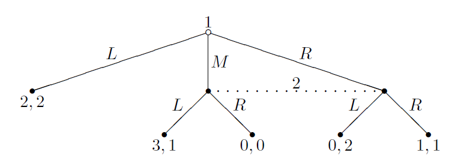
```

Exemplo de um jogo de informação imperfeita com equilíbrio perfeito em subjogos que não obedece racionalidade sequencial

---
class: middle, center, inverse

# Jogos multi-estágios e repetidos (Tadelis, caps. 9 e 10)

---
class: middle
## Jogos multi-estágios

Até aqui vimos jogos em que um único jogo se desenrola no tempo &mdash; uma situação ligeiramente diferente é na qual os mesmos jogadores jogam **jogos de estágio** repetidas vezes (recebendo o *payoff* deles a cada período)

Nesse caso, a pergunta que surge é se os jogadores podem condicionar sua atuação em estágios futuros no comportamento em estágios iniciais, e assim expandir o conjunto de soluções para além dos equilíbrios do jogo de estágio

Um jogo multiestágio é uma sequencia de jogos *em forma normal* em que *os mesmos* $N$ jogadores jogam sequencialmente e de forma completa, um jogo em cada período, e a soma dos *payoffs* é avaliada no final da interação


---
class: middle
## Dilema dos prisioneiros com vingança

```{r, echo=FALSE, out.width = '90%', fig.align='center'}
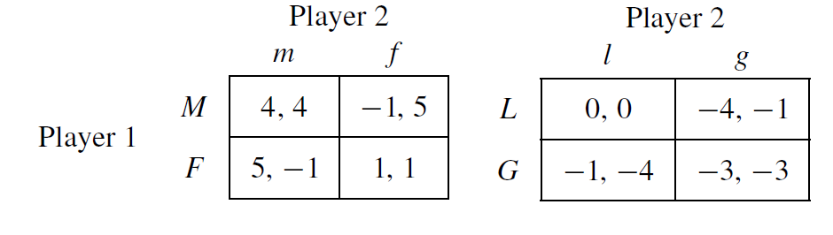
```

Considere que dois prisioneiros jogam o dilema primeiro (esquerda), mas depois do jogo eles se encontram novamente um jogo de vingança, em que eles podem desistir da vida de crime $l$ ou juntar-se a uma gangue $g$ &mdash; a essa altura do campeonato deve ser fácil achar os equilíbrios de Nash dos jogos de estágio, mas muda algo jogá-los um após o outro?


---
class: middle
## Estratégias

Como em (outros) jogos na forma extensiva, estratégias aqui são mais complicadas que em jogos estáticos: elas elencam para cada **história** de jogo um predição de ação para o jogo de estágio

Nesse exemplo, uma estratégia para o jogador 1 é um quintupla: $$(\sigma_1^1, \sigma_1^2(M, m), \sigma_1^2(M, f), \sigma_1^2(F, m), \sigma_1^2(F, f))$$

O fato da estratégia no período 2 ser função do que foi jogado no período 1 é o que abre novas avenidas de cooperação (e o que torna jogos multi-estágios interessantes de se analisar)

---
class: middle
## Equilíbrios em jogos multi-estágios

Qualquer combinação de *equilíbrios de Nash* dos jogos de estágio forma um equilíbrio (na verdade *perfeito em subjogos*!) do jogo multi-estágio

Assim, $((F,f), (G,g))$ e $((F,f), (L, l))$ (e mais um) são "trivialmente" equilíbrios perfeitos em subjogos do jogo repetido &mdash; mas gostaríamos de mais!

Será que é possível construir um equilíbrio perfeito em subjogos em que $(M,m)$ é jogado no primeiro período?

---
class: middle
## O princípio do desvio único

No exemplo anterior foi simples pensar em quais desvios deveríamos analisar &mdash; mas se tivermos, por exemplo, $T=30$ períodos, a princípio teríamos que considerar desvios da forma "Em $t=2$ eu jogo $F$ ao inves de $M$, daí em $t=10$ eu jogo $L$ ao invés de $G$ e $t=30$ troco $M$ por $F$": uma tarefa hercúlea quando $T$ cresce!

Mas por sorte isso é desnecessário (ufa!), pois o **princípio do desvio único (Blackwell, 1965)** diz que uma estratégia é ótima se e somente se não existe nenhum história tal que um desvio *apenas no jogo de estágio que segue a essa história* (mantendo a *estratégia* constante) gere um ganho de *payoff*

---
class: middle
## Jogos repetidos

Um tipo particular de jogos multi-estágio é bastante famoso em teoria dos jogos: os **jogos repetidos**, que nada mais são que jogos multi-estágio em que o jogo de estágio $G$ é sempre o mesmo

Há dois tipos de jogos repetidos: jogos *finitamente* repetidos $G^T$ e jogos *infinitamente* repetidos $G^{\infty}$ &mdash; como veremos, surpreendentemente a diferença dos dois pode ser significativa mesmo quando $T$ finito é grande

A diferença é que em $G^T$ sempre há a "ameaça do último período" (em $T$), quando já não há mais incentivos futuros para cooperar, enquanto em $G^{\infty}$ sempre há uma probabilidade positiva do jogo durar mais um período

---
class: middle
## Taxa de desconto

Em economia, é comum "descontar" fluxos futuros de utilidade a uma taxa $\delta < 1$, para modelar a intuição de que ganhos hoje seriam mais valiosos que os mesmo ganhos no futuro: e a mesma ideia pode ser aplicada a jogos

Para simplificar, em jogos finitos suporemos que eles são jogados "em pouco tempo", e não usaremos taxas de desconto &mdash; mas para jogos infinitos isso nos traria dificuldades pois a soma das utilidades seria infinita!

Nesse caso normalizamos a utilidade multiplicando tudo por $(1-\delta)$, de forma que a utilidade de um caminho que dê *payoff* $3$ agora e $-1$ no futuro é: $$(1-\delta)3 + (1-\delta)\delta(-1) + (1-\delta)\delta^2(-1)+(1-\delta)\delta^3(-1)+...$$
$$= (1-\delta)3 + (1-\delta)\delta\frac{(-1)}{1-\delta} = (1-\delta)3 + \delta(-1)$$

---
class: middle
## Taxa de desconto e o fim do jogo

Jogos evidentemente nunca duram para sempre (infelizmente, os jogadores morrem): a ideia do jogo infinitamente repetido é que por mais que ele acabe em algum momento, *os jogadores não sabem quando*

Considere que o jogo acaba com uma probabilidade $\lambda$ a cada período (o que é conhecimento comum), e os jogadores descontam a uma taxa $\delta$ o tempo: então fazendo $\Delta = (1 - \lambda)\delta$ ainda temos um jogo "infinitamente" repetido (ainda que ele dure para sempre com probabilidade zero) 

Essa promessa que sempre existe de que o jogo possa durar pelo menos mais alguns períodos é o que sustenta os incentivos intertemporais


---
class: middle
## Autômatos

O *princípio do desvio único* ajuda (e muito!) em reduzir o número de estratégias alternativas que temos que considerar: mas ainda assim em princípio há infinitas histórias em que cada jogador pode querer desviar!

Podemos ainda simplificar muito essas estratégias colocando-as em "classes de equivalência", onde em cada classe o comportamento dos jogadores é igual

Fazemos isso construindo **autômatos**, como algoritmos que implementam as estratégias de jogo dos jogadores &mdash; podemos representar cada jogador por um autômato, mas frequentemente é mais simples usar um para o *perfil* de estratégias

---
class: middle
## Autômatos

Um **autômato** é composto de: (i) um conjunto de estados $\mathcal{W}$, (ii) um estado inicial $w_0$, (iii) uma função $f$ que especifica em cada estado o que jogar, e (iv) uma função de transição $\tau$ que muda de estado dependendo da realização do jogo

Utilizando autômatos checar se um perfil de estratégias é perfeito em subjogos somente requer checar para cada um dos estados do autômato se existe algum desvio (único!) que é vantajoso 

Para vários autômatos importantes, como o **grim trigger** ou o **tit-for-tat**, há apenas 2-4 estados, então simplifica muito!

---
class: middle
## Grim trigger

```{r, echo=FALSE, out.width = '60%', fig.align='center'}
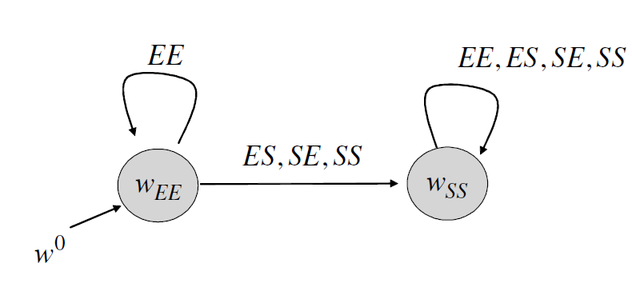
```

O exemplo mais clássico de estratégia, que também é o mais simples de se representar por autômatos, é o **grim trigger**: no dilema dos prisioneiros, todos os jogadores começam cooperando (i.e., em $w_{EE}$, onde jogam $EE$), mas assim que alguém desvia de $EE$ eles mudam para sempre para $w_{SS}$, onde sempre confessam (por isso que é "grim")

---
class: middle
## Tit-for-tat

Outra estratégia famosa no dilema dos prisioneiros é a **tit-for-tat**, que venceu o torneio de Axelrod de jogo repetido do dilema dos prisioneiros

A ideia é simples: o jogador começa cooperando, e sempre faz a última coisa que o outro jogador fez ("tit for tat" é uma expressão em inglês que significa uma retaliação equivalente)

É uma punição bem menos "grim" que o grim trigger, já que se o outro jogador "se arrepender" e voltar a cooperar, o *tit-for-tat* também volta a cooperar &mdash; qual será o autômato que representa esse perfil de estratégias?

---
class: middle
## Teoremas Folk

*Teoremas folk* (há dezenas deles) estabelecem condições para que (quase) *qualquer* resultado do jogo seja um equilíbrio do jogo repetido &mdash; o nome "teorema folk" vem do fato do 1º deles circular bastante na década de 50 entre os teoristas dos jogos, sendo difícil nomear quem primeiro o inventou

**Teorema de Folk para estratégias puras:** Se o jogo de estágio é finito e entre 2 jogadores, então se $\delta$ for suficientemente próximo de $1$, temos que para cada perfil de ações puras $\widetilde{a}$ *estritamente racionais* (isto é, que dá *payoff* acima da estratégia minimax), existe um equilíbrio perfeito em subjogos em que $\widetilde{a}$ é jogado em todo período


---
class:middle
# Bibliography

<small>
```{r refs, echo=FALSE, results="asis"}
PrintBibliography(myBib)
```
</small>
