class: inverse, middle, center

```{r, load_refs, include=FALSE, cache=FALSE}
library(RefManageR)
BibOptions(check.entries = FALSE,
           bib.style = "alphabetic",
           cite.style = "alphabetic",
           style = "markdown",
           hyperlink = FALSE,
           dashed = FALSE)
myBib <- ReadBib("./eae0522_bib.bib", check = FALSE)
```

# Jogos estáticos de informação incompleta (Tadelis, cap. 12)

---
class: middle
## Informação incompleta

Nos jogos vistos até aqui, mesmo quando havia atos passados não observados pelos jogadores (informação *imperfeita*), sempre todas as características do jogo eram *conhecimento comum* (incluindo a própria **informação completa**)

Em várias situações que vimos nos exercícios, a análise desses jogos levou a soluções contraintuitivas, e nos perguntamos se isso não seria porque os jogadores têm "certeza demais" do que vai acontecer

Ademais, remover tais suposições nos aproxima das situações do mundo real, em que quase sempre jogadores possuem mais informação sobre seus *payoffs* e ações disponíveis que os outros jogadores, i.e., **informação assimétrica**

---
class: middle
## Informação incompleta

Mas alguma informação é necessária para os jogadores poderem analisar racionalmente o jogo: se eles não sabem o que o oponente pode fazer, quais são os seus *payoffs*, como formarão crenças sobre as suas ações?

Harsanyi ganhou o Nobel de 1994 propondo uma ideia que *a posteriori* pode parecer um pouco óbvia (assim como de certa forma um *cop out*): transformar o jogo de informação **incompleta** em um jogo de informação **imperfeita**

A ideia é simples: cada possível estado do mundo é um jogo diferente (de informação completa!), a natureza escolhe no começo do jogo qual é o estado real, e os jogadores (ou parte deles) não observam essa escolha

---
class: middle
## Tipos

Harsanyi desenvolveu o conceito de **tipos**: o tipo de um jogador inclui características dele e a informação que ele tem das outras característas do jogo &mdash; o perfil de tipos escolhido pela natureza é o **estado da natureza**

Também é necessário que cada jogador tenha uma distribuição de probabilidade (um **prior**) sobre os diferentes *estados da natureza* (e tudo isso é *conhecimento comum*) &mdash; e na verdade esses *priors* tem que ser iguais!

Aumann (Nobel '05) provou que *priors* iguais e agentes que atualizam seu *prior* pela **regra de Bayes** implicam que em equilíbrio os jogadores concordam em seus *posteriors* &mdash; é impossível "concordar em discordar"

---
class: middle
## Estágios do jogo

Um jogo de informação incompleta tem 3 estágios:

1. O estágio ***ex-ante*** é antes de qualquer informação ser revelada: jogadores não sabem o tipo dos oponentes nem os deles
2. O estágio ***interim*** é quando os jogadores descobrem o seu tipo, mas ainda não sabem o tipo dos outros jogadores: é o "mais importante", quando eles formulam um plano de jogo
3. Finalmente, quando o jogo termina é o estágio ***ex-post***, quando os *payoffs* são distribuídos e os jogadores descobrem os tipos dos outros jogadores

Uma pergunta razoável é se deveríamos resolver o jogo no estágio *ex-ante* ou *interim* &mdash; por sorte, tal reflexão é desnecessária, pois dá na mesma 


---
class: middle

```{r, echo=FALSE, out.width = '45%', fig.align='center'}
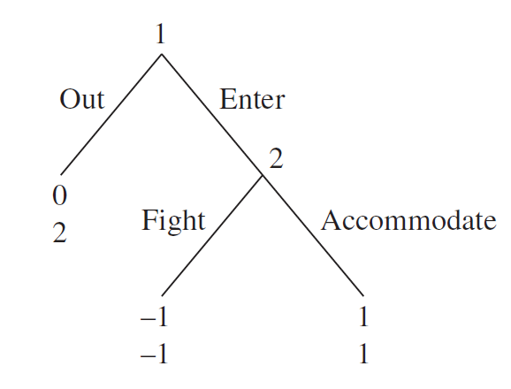
```

No clássico jogo de **dissuação estratégica de entrada** a firma 1 decide se entra no mercado, e a firma 2 decide se briga com ela ou não (se ela decidir entrar) &mdash; um argumento simples de indução para trás nos mostra que o único equilíbrio perfeito em subjogos a firma 1 entra e a firma 2 não briga (e os outros EN, quais são?)

---
class: middle

```{r, echo=FALSE, out.width = '50%', fig.align='center'}
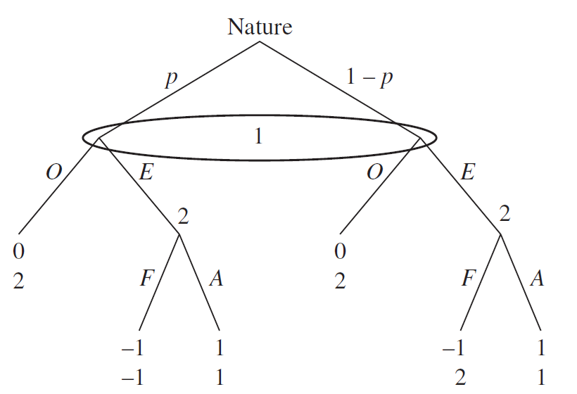
```

Imagine agora que há dois *tipos* possíveis de firma 2: com probabilidade $p$ ela é como antes, mas com $1-p$ ela gosta de brigar, tendo *payoff* 2 ao brigar com a entrante &mdash; usando o método de Harsanyi, transformamos esse jogo de informação *incompleta* em um jogo de informação *imperfeita*

---
class: middle
## And that's that!

E é isso: acabamos a teoria de jogos de informação incompleta (e eu estou só um pouco brincando!) Discutiremos agora jogos de informação *imperfeita* no qual após um lance da natureza a interação é estática: os **jogos bayesianos**

E no fim do curso discutiremos jogos que se alongam na forma extensiva com jogada da natureza não observável no começo: nesse caso, os agentes vão alterando ao longo do jogo as suas crenças sobre o *tipo* dos outros jogadores

Note que aqui o ENPS não ajuda: como a imperfeição informacional é na definição inicial do estado da natureza, *o jogo geralmente possui apenas 1 subjogo* (o trivial) &mdash; então precisaremos de novos *refinamentos de equilíbrio*!

---
class: middle
## Jogos bayesianos

**Jogos bayesianos**, ou jogos estáticos de informação incompleta, são compostos dos seguintes elementos (e tudo conhecimento comum!):

1. Os jogadores
2. As ações de cada jogador
3. As preferências de cada *tipo* de jogador para cada perfil de ações resultantes do jogo 
3. Os possíveis **estados da natureza** $T$, que são os possíveis perfis de tipos de cada jogador $t_i$, que contém toda a informação relevante sobre aquele jogador, incluindo o que ele sabe sobre o jogo
4. *Uma* distribuição de probabilidade sobre os estados da natureza, a dizer um **prior** (comum) dos jogadores sobre as possíveis formas do jogo

---
class: middle

```{r, echo=FALSE, out.width = '75%', fig.align='center'}
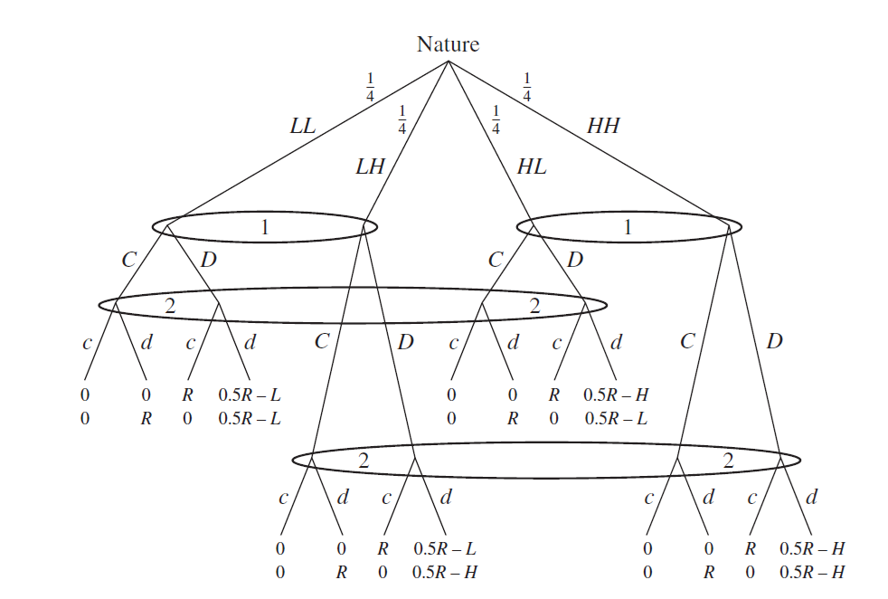
```

Por mais que definamos um jogo bayesiano como um tipo próprio de jogo, é sempre bom lembrar que pela transformação de Harsanyi eles são sempre exatamente equivalentes a um jogo de forma extensiva com informação imperfeita &mdash; acima, um jogo de chicken! com informação incompleta, onde os pais podem ser lenientes (tipo $L$) ou harsh (tipo $H$)

---
class: middle

```{r, echo=FALSE, out.width = '70%', fig.align='center'}
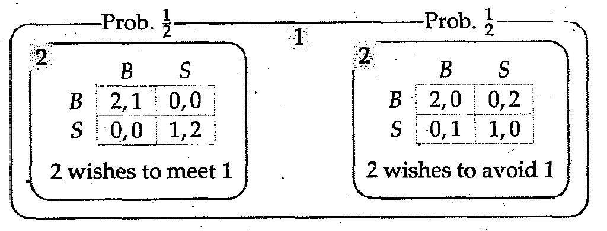
```

Exemplo de um jogo bayesiano: uma variante da batalha dos sexos em que Bernardo pode querer encontrar ou evitar Ana &mdash; Bernardo sabe o seu tipo, mas Ana não sabe

---
class: middle
## Crenças em jogos bayesianos

Em alguns casos, um jogador tem certeza do *estado da natureza*, enquanto o outro não sabe (um caso extremo de **informação assimétrica**) &mdash; em outros, ambos os jogadores podem ter *sinais* diferentes sobre o estado da natureza

Nesse caso, o tipo de $i$ dá informação (um *sinal*) sobre o tipo dos outros jogadores &mdash; e com isso ele vai atualizar a sua *prior* sobre o estado da natureza condicional no seu próprio tipo

Se em um oligopólio a probabilidade da outra firma ter alta produtividade é maior quando a própra firma é produtiva (os tipos são correlacionados), então ela tem que levar isso em conta ao montar sua estratégia, por exemplo

---
class: middle
## Probabilidade condicional

A **probabilidade condicional** de $A$ dado $B$ (ou seja, sabendo que $B$ ocorreu) é dada por, *se $\Pr (B) > 0$*:

$$\Pr (A | B) = \frac{\Pr (A \cap B)}{\Pr (B)}$$
Onde a *intersecção* entre os eventos $A$ e $B$, $A \cap B$, lê-se "A *e* B" &mdash; aqui $\Pr (A)$ é o **prior** do jogador sobre a probabilidade do evento $A$ acontecer, e $\Pr (A | B)$ é o **posterior** dessa probabilidade após observar que $B$ ocorre

---
class: middle

```{r, echo=FALSE, out.width = '45%', fig.align='center'}
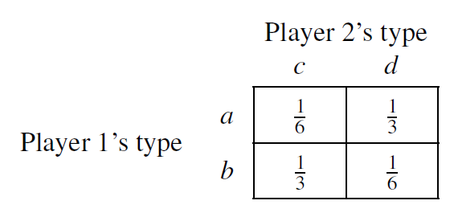
```

Considere uma situação em que jogador 1 pode ser do tipo $a$ ou $b$ e o jogador 2 do tipo $c$ ou $d$. Há portanto **4** *estados da natureza*: $(a,c)$, $(a,d)$, $(b,c)$ e $(b,d)$. As probabilidades são dadas na matriz acima. Se o jogador 1 souber que é do tipo $a$, qual a *probabilidade condicional* do jogador tipo 2 ser de cada tipo?

---
class: middle
## Estratégias

Até aqui uma **estratégia pura** é uma função que aloca para cada *conjunto informacional* do jogador, uma ação disponível naquele conjunto

Em jogos bayesianos, o conjunto informacional dos jogadores é inteiramente contido no seu tipo, de forma que uma estratégia $s_i (\theta_i)$ é uma função que leva do tipo do jogador $i$, $\theta_i$, para uma ação disponível a ele no jogo estático

Notem que como cada jogador usa uma estratégia pura que depende do seu tipo escolhido pela natureza, então na perspectiva dos outros jogadores é como se ele escolhesse uma estratégia mista

---
class: middle
## Equilíbrio bayesiano

Chamamos de equilíbrio bayesiano o *equilíbrio de Nash* do jogo em forma extensiva de informação *imperfeita* que representa (na transformação de Harsanyi) o jogo estático de informação *incompleta* 

De forma mais direta, um perfil de estratégias $s_i (\theta_i)$ é um **equilíbrio de Nash bayesiano** (ENB) quando para cada tipo $\theta_i$ de cada jogador $i$, 

$$\sum_{\theta_{-i}} \phi (\theta_{-i} | \theta_i) u_i (s_i^*(\theta_i), s_{-i}^* (\theta_{-i}); \theta_i) \geq \sum_{\theta_{-i}} \phi (\theta_{-i} | \theta_i) u_i (s_i (\theta_i), s_{-i}^* (\theta_{-i}); \theta_i)$$

para toda outra estratégia $s_i$ &mdash; onde $\phi (\theta_{-i} | \theta_i)$ é a probabilidade condicional do estado da natureza ser $(\theta_i, \theta_{-i})$ dado que o tipo de $i$ é $\theta_i$

---
class: middle

```{r, echo=FALSE, out.width = '65%', fig.align='center'}
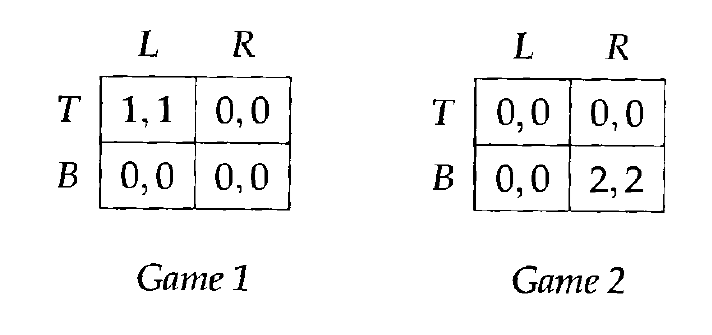
```

Imagine o cenário em que dois jogadores interagem em uma situação que pode ser do tipo jogo 1 ou jogo 2 (os estados da natureza), e que o jogador 1 sabe qual é o jogo certo, mas o jogador 2 não sabe (e crê que são equiprováveis) &mdash; quais são os ENB desse jogo?

---
class: middle
## Estratégias mistas e purificação

Já vimos que uma dificuldade (enorme) com EN em estratégias mistas é que ele requer que cada jogador aleatorize entre suas ações de uma forma extremamente particular, *mesmo com o seu payoff não dependendo da sua escolha, puramente para deixar o outro jogador indiferente*

Harsanyi deu outra explicação para equilíbrios em estratégias mistas baseado em *informação incompleta*

A intuição é que alguns jogadores preferem jogar par, outros preferem ímpar, mas isso é desconhecido pelo jogador &mdash; e portanto, é *como se* jogassem estratégias mistas

---
class: middle
## O Teorema da Purificação de Harsanyi

```{r, echo=FALSE, out.width = '45%', fig.show='hold'}
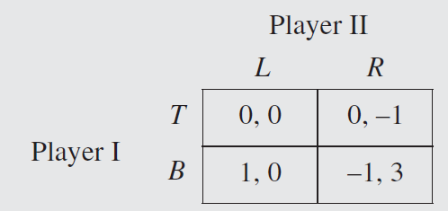
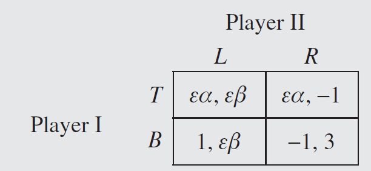
```

Harsanyi propôs a seguinte ideia: imagine que há vários tipos de jogadores 1 e 2, alguns preferem (um pouquinho) jogar $L$ ou $R$, $T$ ou $B$ (ver acima), com $\alpha$ e $\beta$ um valor uniforme entre $[-1, 1]$

Existe $\alpha_0$ e $\beta_0$ tal que jogador 1 joga $T$ se $\alpha > \alpha_0$ e jogador 2 joga $L$ se $\beta > \beta_0$ &mdash; Harsanyi provou que na medida que $\varepsilon$ fica cada vez menor, a probabilidade (*ex-ante*) de cada estratégia se aproxima do EN `r Citep(myBib, "govindan2003short")`

---
class: middle

```{r, echo=FALSE, out.width = '65%', fig.align='center'}
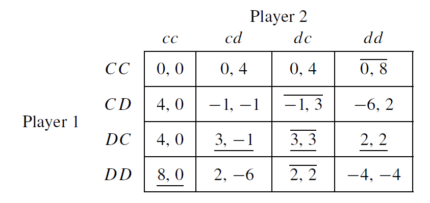
```

O problema do chicken! com informação incompleta, com $R = 8$, $H = 16$ e $L = 0$ &mdash; aqui montamos a forma normal para cada estratégia, lembrando que uma estratégia é uma função $s_i (\theta_i)$: como aqui $\theta \in \{L, H \}$, então a estratégia é um par $s(L), s(H)$: resta portanto que o ENB é apenas o equilíbrio de Nash da forma normal do jogo em forma extensiva

---
class: middle
## Seleção adversa

Há 2 formas de informação assimétrica importantes em economia: *ações não observáveis* (risco moral) e *tipos não observáveis* (seleção adversa) &mdash; esse segundo é naturalmente modelado como um jogo bayesiano

Considere que o jogador 1 é dono de uma fazenda, que pode ter valor para ele $v_1$ igual a $L$ (10), $M$ (20) ou $H$ (30), todos equiprováveis, e deseja vender para um produtor de soja &mdash; mas apenas o dono observa o tipo da fazenda

O produtor de soja é mais eficiente que o dono na plantação, dando valor para a terra de $v_2 = v_1 + 4$: evidentemente o eficiente de mercado é a venda se concretizar &mdash; mas será que isso sempre ocorre?
 
 
---
class: middle

```{r, echo=FALSE, out.width = '60%', fig.align='center'}
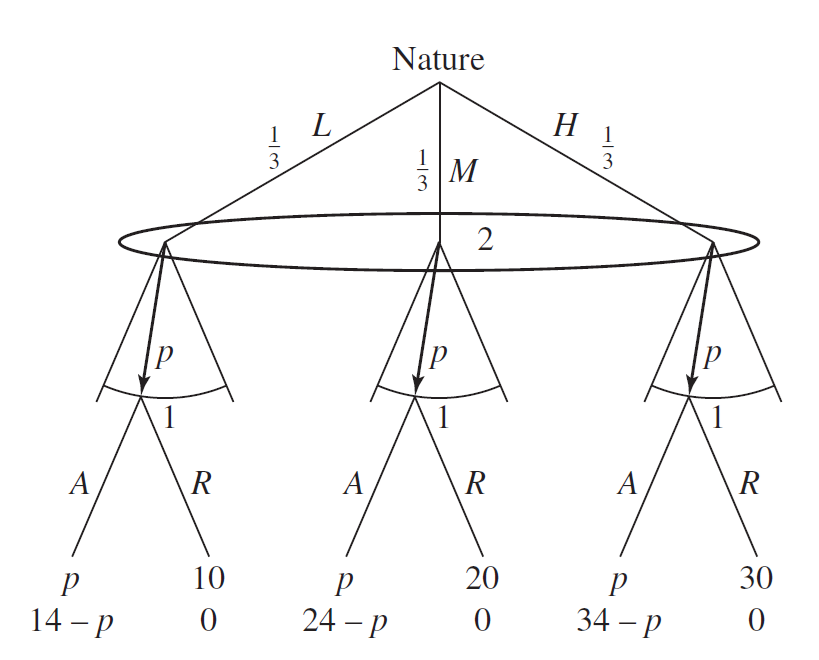
```

Como sempre, pelo método de Harsanyi, transformamos aquele jogo de informação *incompleta* (que não sabemos resolver) em um jogo de informação *imperfeita*, como acima, e calculamos os equilíbrios de Nash do jogo em forma extensiva (que são os ENB do jogo bayesiano)

---
class: middle, center, inverse

# Jogos dinâmicos de informação incompleta (Tadelis, cap. 15)

---
class: middle
## Jogos dinâmicos e crenças

Para analisar jogos bayesianos já utilizamos a probabilidade condicional, mas foi de forma "simplória": a única informação que os jogadores possuiam sobre o tipo dos outros jogadores era o seu próprio tipo

**Jogos dinâmicos de informação imperfeita** (já que transformamos por Harsanyi informação *incompleta* em *imperfeita*) trazem um aspecto que os torna muito mais interessantes (mas também bem mais difíceis): a própria *estratégia* dos outros jogadores nos informa sobre o tipo deles

Aqui também veremos como aplicar a ideia de *racionalidade sequencial* quando o equilíbrio perfeito em subjogos é pouco útil, como já discutido


---
class: middle

```{r, echo=FALSE, out.width = '50%', fig.align='center'}

```

Voltemos ao jogo de *dissuação estratégica de entrada* do começo desse tópico, e considere $p=2/3$: quais são os equilíbrios de Nash do jogo acima? E perfeito em subjogos?

---
class: middle

```{r, echo=FALSE, out.width = '50%', fig.align='center'}
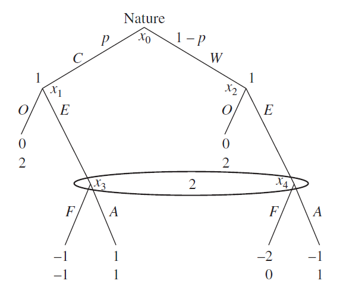
```

No slide anterior, o conceito de ENPS ainda tem um pouco de "mordida", já que o jogo tem um subjogo não-trivial &mdash; mas se trocarmos a informação assimétrica de lado vemos quão grave é o problema de ENPS em jogos de informação incompleta (com a transformação de Harsanyi): temos dois equilíbrios de Nash em estratégias puras, *ambos* perfeitos em subjogos

---
class: middle
## O equilíbrio perfeito bayesiano

Para podermos aplicar o conceito de *racionalidade sequencial*, precisamos levar a ideia de que jogadores racionais sempre escolhem uma melhor-resposta *para dentro* do conjunto informacional

Mas dentro de um conjunto informacional, o jogador não sabe em qual vértice ele está: temos que levar mais a sério as **crenças** dos jogadores na definição de equilíbrio

E essas *crenças* por si próprias precisam ser "racionais": que nesse curso quererá dizer *que são atualizadas pela* ***regra de Bayes***

---
class: middle
## Crenças

Um **sistema de crenças** $\mu$ de um jogo em forma extensiva (de informação imperfeita) determina probabilidades para cada vértice de um conjunto informacional

Como em todos conceitos de equilíbrio, vamos supor que os agentes *sabem o que os oponentes vão fazer* (ou em outras palavras, as suas crenças sobre as estratégias dos outros jogadores são corretas)

Assim, o sistema de crenças deve ser *consistente com as estratégias dos outros jogadores* (incluindo a natureza) &mdash; os jogadores *atualizam as suas crenças seguindo a regra de Bayes de acordo com o perfil de estratégias de equilíbrio*

---
class: middle
## Equilíbrio perfeito bayesiano

Reunindo tudo, um perfil de estratégias $\sigma^*$ é um **equilíbrio perfeito bayesiano** (PBE) (*refinamento* do equilíbrio de Nash) quando:

1. Todo jogador possui um sistema de crenças $\mu$
2. Em todos os conjuntos informacionais **no caminho de equilíbrio** o sistema de crenças é consistente com a *regra de Bayes*
3. **Fora do caminho de equilíbrio** o sistema de crenças pode ser qualquer coisa
4. Os jogadores em todos os seus conjuntos informacionais (no caminho de equilíbrio ou fora) jogam *melhor-respostas* para o seu sistema de crenças $\mu$ (**racionalidade sequencial**)

---
class: middle
## Regra de Bayes

Pela definição de probabilidade condicional, $\Pr (A \cap B) = \Pr (A | B) \Pr (B)$, e por simetria, também vale que $\Pr (A \cap B) = \Pr (B | A) \Pr (A)$ &mdash; isso nos dá a fundamental **regra de Bayes**:

$$\Pr (A | B) = \frac{\Pr (B | A) \Pr (A)}{\Pr (B)} = \frac{\Pr (B | A_i) \Pr (A_i)}{\sum_{k=1}^K \Pr (B | A_k) \Pr(A_k)}$$

Trocando $A$ por $A_i$, que é um evento específico dentre $K$ eventos possíveis que sejam excludentes e cuja probabilidades somam $1$ (por exemplo, "ir na ópera" dentre "ir na ópera" e "ir ao futebol" na guerra dos sexos)


---
class: middle
## Regra de Bayes e probabilidade zero

As condições 2 e 4 juntas implicam que se $\sigma^*$ é um equilíbrio bayesiano e ele atinge todos os conjuntos informacionais de todos os jogadores, então $\sigma^*$ também é um equilíbrio perfeito bayesiano

A grande dificuldade do PBE, assim como de toda noção de equilíbrio para jogos extensivos de informação imperfeita, é o que fazer com conjuntos informacionais "impossíveis"

Como a Rainha Vermelha falou para Alice, "Eu às vezes penso até seis coisas impossíveis antes do café da manhã"

---
class: middle
## Regra de Bayes e probabilidade zero

A regra de Bayes define que se $\Pr (B) = 0$, então $\Pr (A_i | B)$ pode ser qualquer coisa &mdash; em probabilidade e estatística qual é essa probabilidade não importa, já que o evento $B$ ocorre com probabilidade zero!

Mas a análise de contrafactuais é essencial para a teoria dos jogos! O que acontece *fora do caminho de equilíbrio* pode nunca acontecer de fato, mas ainda é essencial para definir o que acontece *dentro do caminho de equilíbrio*!

Então em teoria dos jogos, quais são as crenças dos agentes em conjuntos informacionais que nunca ocorrem de fato é essencial para definir quais são os equilíbrios do jogo

---
class: middle
## Probabilidade zero e refinamentos

E com isso é possível construir equilíbrios bastante irrazoáveis manipulando as crenças dos jogadores em conjuntos informacionais fora do caminho de equilíbrio! 

Por esses problemas que esses jogos são um terreno fértil para *refinamentos de equilíbrio* &mdash; o principal deles é o **equilíbrio sequencial**: veremos que o equilíbrio sequencial elimina alguns equilíbrios desse tipo, mas não a maioria

A ideia é criar uma sequência de estratégias *completamente mistas* e crenças atualizadas em relação a elas pela regra de Bayes, e exigir que as crenças em conjuntos de probabilidade zero sejam parecidas com essas

---
class: middle
## Equilíbrio sequencial

De forma um pouco mais precisa, dizemos que um perfil de estratégias $\sigma^*$ e um sistema de crenças $\mu^*$ é **consistente** se existem estratégias completamente mistas $\sigma^k$ e crenças $\mu^k$ *atualizadas de $\sigma^k$ pela regra de Bayes* tal que: $$\lim_{k\rightarrow \infty}(\sigma^k, \mu^k) = (\sigma^*, \mu^*)$$

Um perfil de estratégias $\sigma^*$ e um sistema de crenças $\mu^*$ é um **equilíbrio sequencial** se é *consistente* e é um *equilíbrio perfeito bayesiano*

---
class: middle
## Equilíbrio sequencial

```{r, echo=FALSE, out.width = '50%', fig.align='center'}
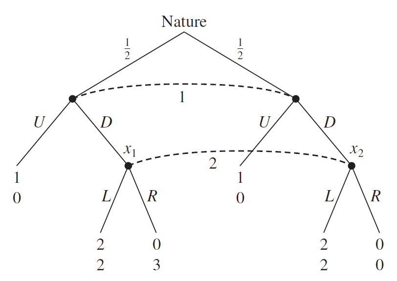
```

Exemplo de jogo com equilíbrios perfeito bayesianos que não são equilíbrios sequenciais

---
class: middle
## Jogo de cartas

```{r, echo=FALSE, out.width = '80%', fig.align='center'}
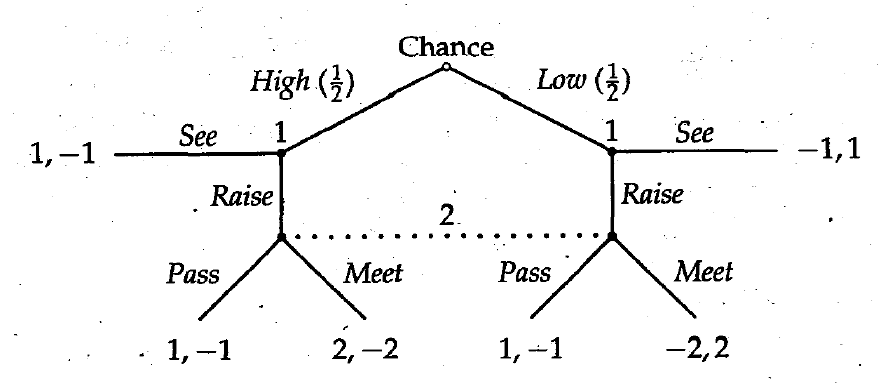
```

Qual é a solução do jogo de cartas acima?

---
class: middle
## Jogos de comunicação

Uma classe importante de jogos são os de *sender-receiver* (**comunicação**), em que um agente informado sobre a escolha da natureza pode comunicar esse estado através de suas ações para um jogador desinformado

Se o *sender* pode apenas mandar mensagens sobre o estado da natureza, então a pergunta é em que situações o *receiver* pode acreditar na mensagem dado que "falar é barato" (modelos de **cheap talk**)

Mas às vezes o *sender* pode se aproveitar de *payoffs* diferentes em diferentes estados da natureza para **sinalizar** o estado para o *receiver* por meio de seus próprios incentivos estratégicos

---
class: middle
## Jogos de comunicação

Jogos de comunicação são apenas jogos extensivos de informação incompleta (que transformamos em informação imperfeita), que já estudamos &mdash; mas o foco em *transmissão de informação* levou a dois novos conceitos

Dizemos que temos um **equilíbrio pooling** se todos os tipos do jogador informado agem de forma igual, e assim não revelam nenhuma informação para o *receiver*

Já um **equilíbrio separador** é quando cada tipo de *sender* manda uma mensagem diferente, de forma que em equilíbrio o *receiver* sabe exatamente qual é o estado da natureza (também pode ser *semi-separador*)

---
class: middle
## O jogo do MBA

```{r, echo=FALSE, out.width = '65%', fig.align='center'}
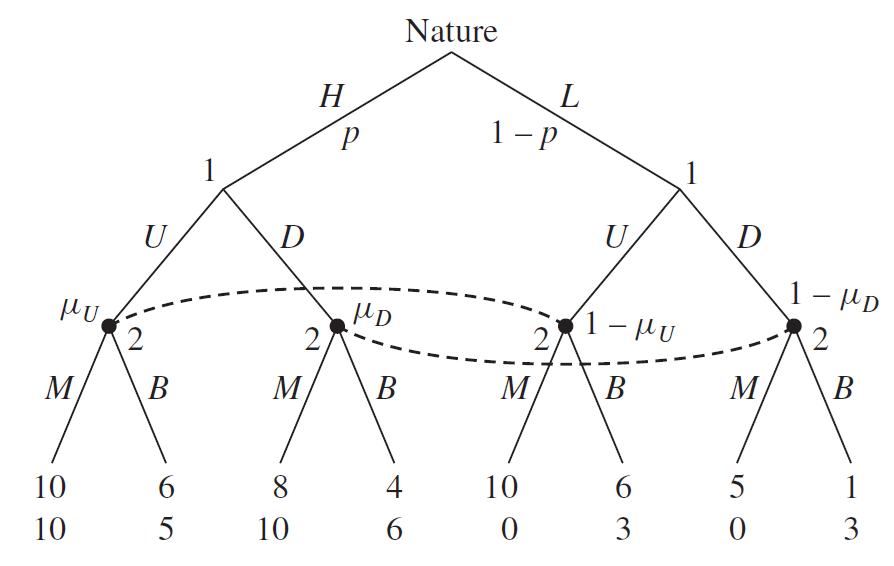
```

O exemplo canônico de *sinalização* é o modelo de educação de Michael Spence (1973), que lhe proveu o prêmio Nobel em 2001

---
class: middle
## Reputação

Outra aplicação importante de jogos em forma extensiva de informação incompleta é em entender **reputações**

Se há uma probabilidade (mesmo que muito pequena) de um jogador ser de um **tipo de comprometimento** (só joga uma ação), então mesmo quando ele não é desse tipo ele pode "fingir que é" (criar uma reputação) para gerar um resultado melhor no jogo

Em várias situações, uma probabilidade ínfima do jogador não ser racional é suficiente para quebrar resultados pouco intuitivos como o jogo centípede, o paradoxo da cadeia de lojas e o dilema dos prisioneiros finitamente repetido

---
class: middle
## O jogo centípede

```{r, echo=FALSE, out.width = '75%', fig.align='center'}
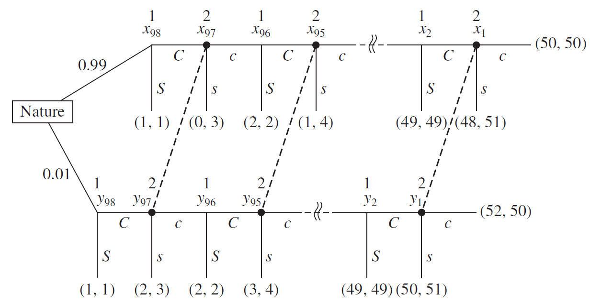
```

No jogo centípede de informação incompleta, mesmo 1% de chance de o jogador 1 ser cooperativo (uma reputação de ser gente fina) é suficiente para quebrar o equilíbrio de deixar todo o dinheiro na mesa

---
class:middle
# Bibliography

<small>
```{r refs, echo=FALSE, results="asis"}
PrintBibliography(myBib)
```
</small>
